# 🔐 Conditional Access Policy — Requiring MFA Authentication

**Platform:** Microsoft Entra ID (Azure AD)  
**Organization:** @tenantname  
**Author:** Kingsley  
**Date:** May 23, 2026  

---

## 📋 Overview

In this lab, I configured a **Conditional Access policy** in Microsoft Entra ID to enforce **Multi-Factor Authentication (MFA)** for a specific group of test users. The lab walks through three phases:

1. **Group Creation** — Microsoft 365 Admin Center
2. **Conditional Access Policy Configuration** — Microsoft Entra Admin Center
3. **End-User MFA Registration & Verification** — Microsoft Authenticator

---

## 🗂️ Table of Contents

- [Phase 1 — Group Creation](#phase-1--group-creation-in-microsoft-365-admin-center)
- [Phase 2 — Policy Configuration](#phase-2--conditional-access-policy-configuration)
- [Phase 3 — MFA Registration & Verification](#phase-3--end-user-mfa-registration--verification)
- [Summary](#summary)

---

## Phase 1 — Group Creation in Microsoft 365 Admin Center

### Step 1 — Navigated to Active Teams & Groups

I opened the **Microsoft 365 Admin Center** and navigated to **Teams & Groups > Active teams & groups**. I could see the existing list of 181 groups in the organization. This was my starting point for creating the test group that would be targeted by the Conditional Access policy.

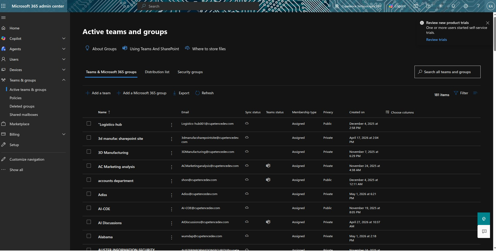

---

### Step 2 — Set Up Group Basics

I clicked **Add a Microsoft 365 group** to launch the group creation wizard. On the **Basics** step, I entered:

- **Name:** `CA-Test-Users`
- **Description:** `Group for Testing of MFA Enforcement`

I then clicked **Next** to proceed.

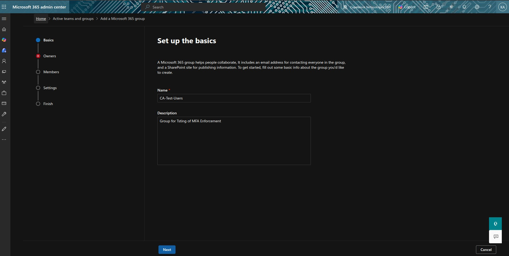

---

### Step 3 — Searched for and Selected Group Owner

On the **Owners** step, I clicked **+ Assign owners** and searched for `KINGS`. From the results I selected **Kingsley** (`kingsley@tenantname`) as the group owner and clicked **Add (1)**.

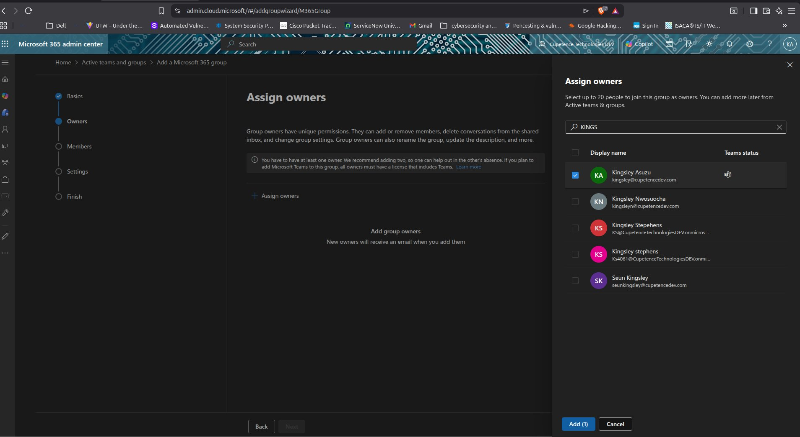

---

### Step 4 — Confirmed Group Owner

The Assign owners page confirmed **Kingsley** was added as the group owner. I clicked **Next** to proceed to the Members step.

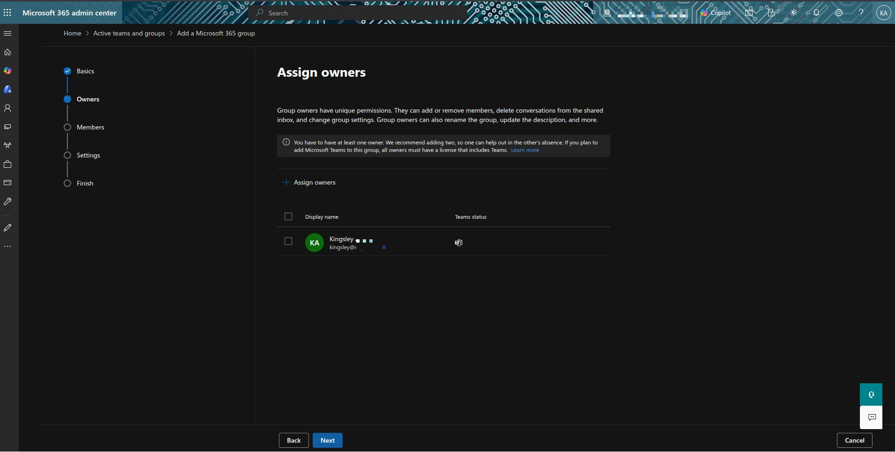

---

### Step 5 — Added Group Member

On the **Add members** step, I searched for `KATE ALL` and selected **kate ALL** (`Kateall@tenantname`) as the group's test member. This is the account I would later use to verify the policy enforcement. I clicked **Add (1)** to confirm.

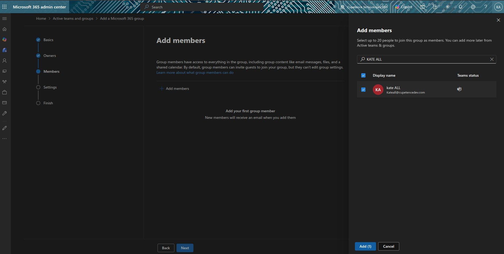

---

### Step 6 — Configured Group Settings

On the **Settings** step, I configured:

| Setting | Value |
|---|---|
| Group email address | `CAT_Test_Uers@tenantname` |
| Sensitivity | None |
| Privacy | Private |
| Add Microsoft Teams | Yes |

I clicked **Next** to proceed to review.

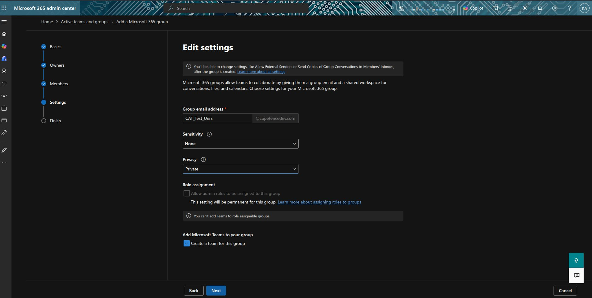

---

### Step 7 — Reviewed and Submitted Group Creation

On the **Review and finish** page, I confirmed all group details before clicking **Create group**:

| Field | Value |
|---|---|
| Group type | Microsoft 365 |
| Name | CA-Test-Users |
| Owner | Kingsley |
| Member | kate ALL |
| Email | CAT_Test_Uers@tenantname |
| Privacy | Private |

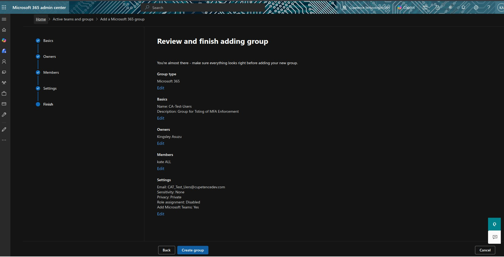

---

### Step 8 — ✅ Group Successfully Created

The wizard confirmed: **CA-Test-Users group created**. The group would appear in Active teams & groups within 5 minutes. Phase 1 was complete.

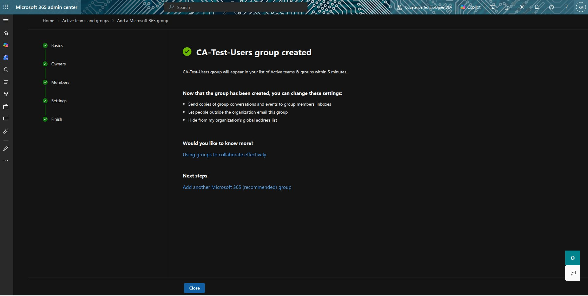

---

## Phase 2 — Conditional Access Policy Configuration

### Step 9 — Reviewed Existing Conditional Access Policies

I navigated to **Microsoft Entra Admin Center > ID Protection > Conditional Access > Policies**. I observed 2 existing user-created policies, both in **Report-only** state. I clicked **+ New policy** to begin creating the MFA enforcement policy.

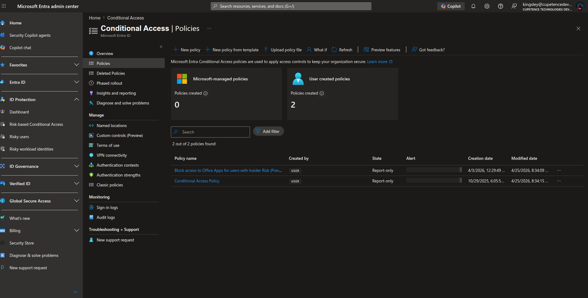

---

### Step 10 — Named the Policy and Targeted the CA-Test-Users Group

I named the new policy **`Require MFA for Test Users`**. Under **Assignments > Users or agents**, I selected **Specific users included**, chose **Users and groups**, searched for `CA-Test-Users`, selected the group, and clicked **Select** to confirm.

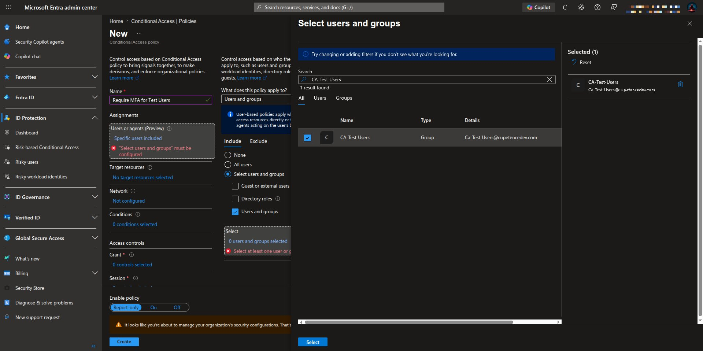

---

### Step 11 — Configured Grant Controls to Require MFA

I opened the **Grant** panel under **Access controls** and configured:

- **Access:** Grant access ✅
- **Control:** Require multifactor authentication ✅

> ⚠️ Note: The system warns that "Require authentication strength" cannot be used simultaneously with "Require multifactor authentication." I acknowledged this and clicked **Select**.

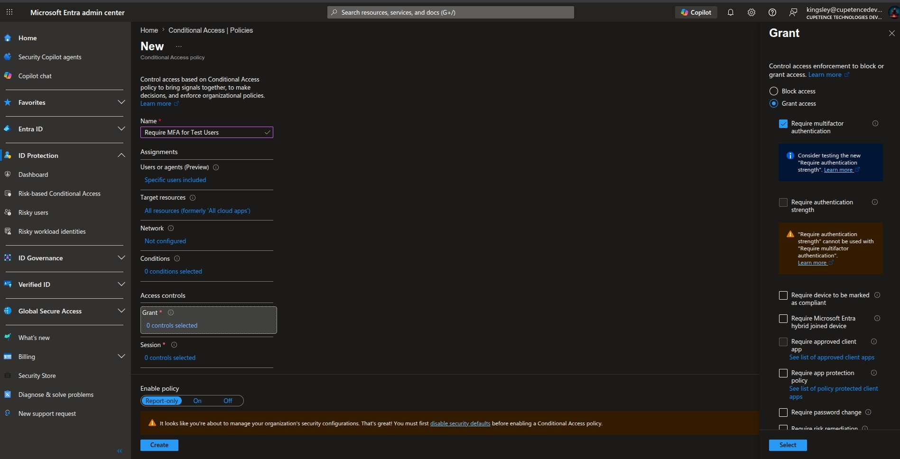

---

### Step 12 — Set Policy to On and Prepared for Creation

With all configurations complete, I reviewed the policy summary and toggled **Enable policy** to **On**. A warning appeared indicating security defaults must be disabled first.

- **Users:** Specific users included (CA-Test-Users)
- **Target resources:** All resources (formerly 'All cloud apps')
- **Grant:** 1 control selected — Require MFA
- **Enable policy:** On

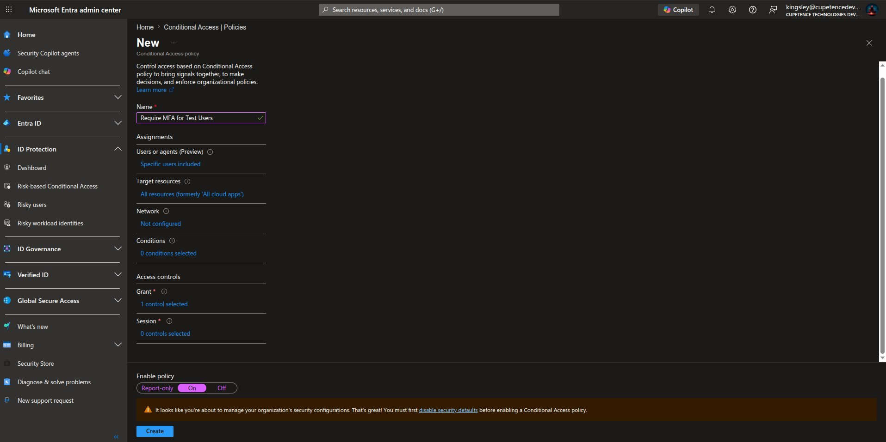

---

### Step 13 — Disabled Security Defaults

The **Security defaults** panel opened on the right. I set Security defaults to **Disabled** and selected the reason:

> ✅ *"My organization is planning to use Conditional Access"*

I acknowledged that the organization would not be fully protected until Conditional Access policies were in place, then clicked **Save**.

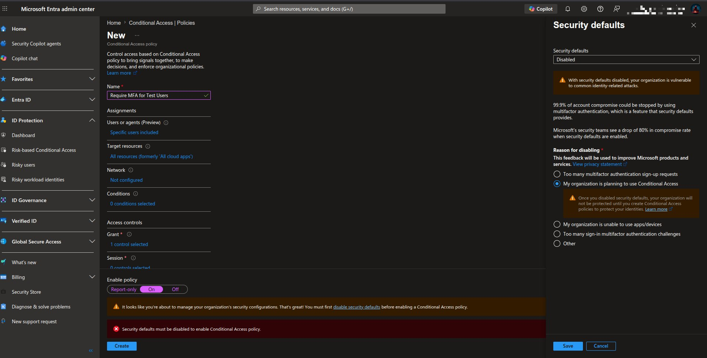

---

### Step 14 — Final Policy Review Before Creation

After disabling security defaults, the policy form was clean with no errors. All assignments and controls were confirmed with Enable policy set to **On**. I clicked **Create** to deploy the policy.

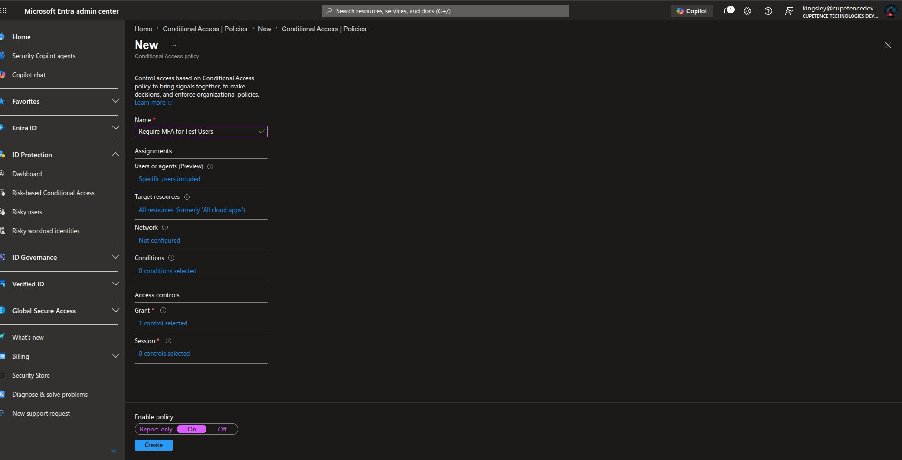

---

### Step 15 — ✅ Policy Successfully Created and Active

The Conditional Access Policies dashboard updated to show **3 user-created policies**. The new **Require MFA for Test Users** policy appeared with:

| Field | Value |
|---|---|
| State | **On** |
| Created by | USER |
| Creation date | 5/23/2026, 4:02:49 |

> ✅ *"Successfully created 'Require MFA for Test Users'. Policy will be enabled in a few minutes."*

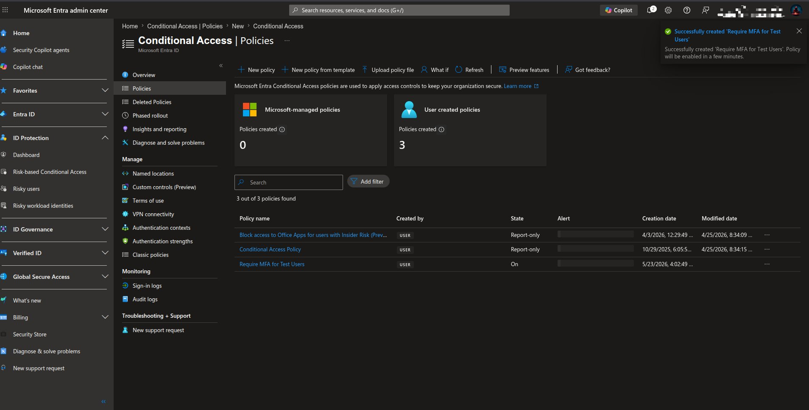

---

## Phase 3 — End-User MFA Registration & Verification

### Step 16 — Signed In as the Test User

To verify the policy was enforcing MFA, I opened a browser and signed in to **login.microsoftonline.com** as the test user **`Kateall@tenantname`** and clicked **Next**.

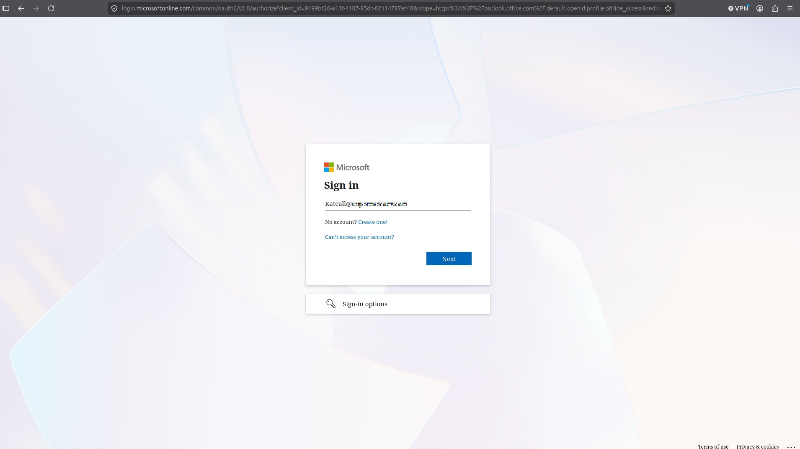

---

### Step 17 — Entered the Test User Password

I entered the test user's password on the **Enter password** screen and clicked **Sign in**. The Conditional Access engine evaluated the sign-in against the active policy.

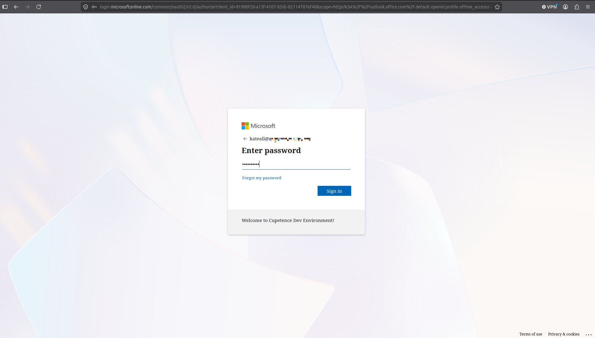

---

### Step 18 — Prompted to Install Microsoft Authenticator

As expected, the Conditional Access policy immediately intercepted the sign-in and triggered an MFA registration requirement. I was redirected to **mysignins.microsoft.com/register** and presented with the **Install Microsoft Authenticator** screen with download links for Google Play and the App Store.

> ✅ This confirmed the policy was actively enforcing MFA on the CA-Test-Users group.

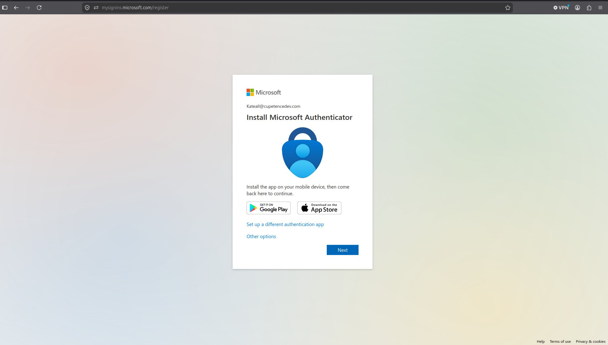

---

### Step 19 — Set Up Account in the Authenticator App

I followed the instructions to open the Microsoft Authenticator app on my mobile device, allow notifications, add an account, and select **Work or school**. I then clicked **Next** to proceed to the QR code step.

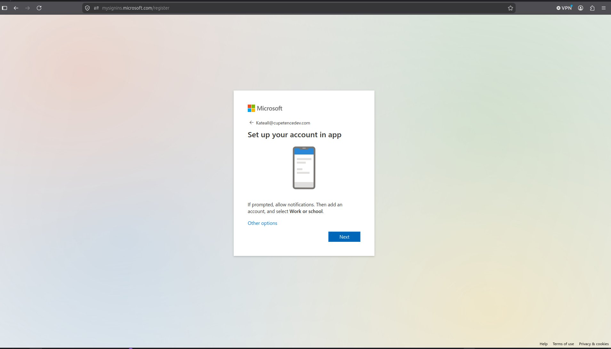

---

### Step 20 — Scanned the QR Code

A QR code was displayed on the screen. I used the Microsoft Authenticator app on the mobile device to scan it, which linked the app to the **Kateall@tenantname** account. I clicked **Next** after scanning.

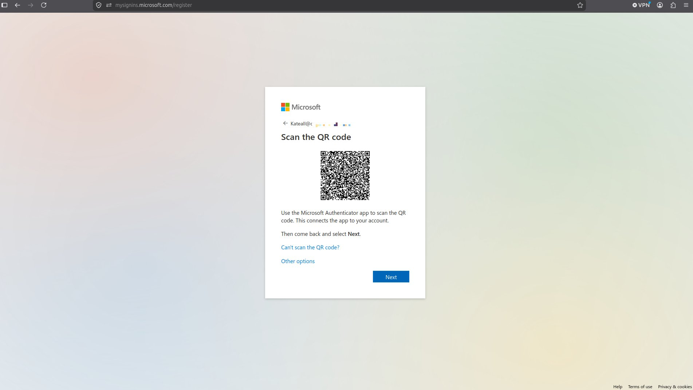

---

### Step 21 — Tested the Push Notification (Number Match)

The **"Let's try it out"** screen displayed the number **35**. I entered this number in the Microsoft Authenticator app on the mobile device to approve the sign-in request. This number-matching step verified that push notifications were working and provided protection against MFA fatigue attacks.

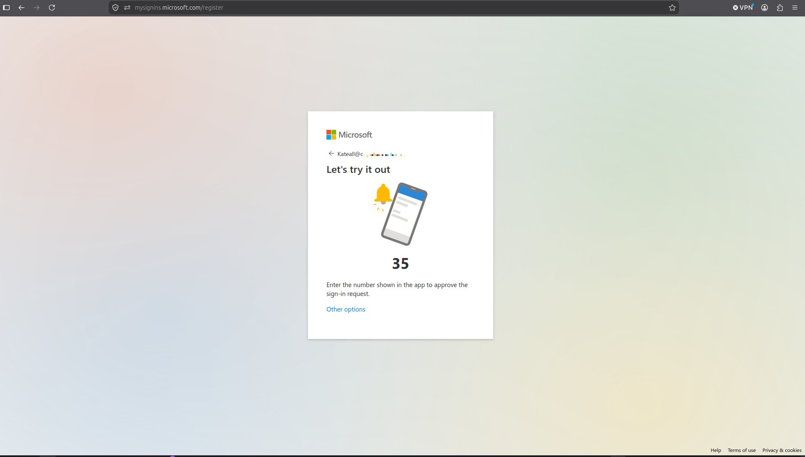

---

### Step 22 — ✅ Authenticator Successfully Added

The screen confirmed **Authenticator Added** with a green checkmark:

> *"You can now use Microsoft Authenticator to approve sign-ins, get one-time codes, and more. This is now your default sign-in method."*

I clicked **Done** to complete MFA registration.

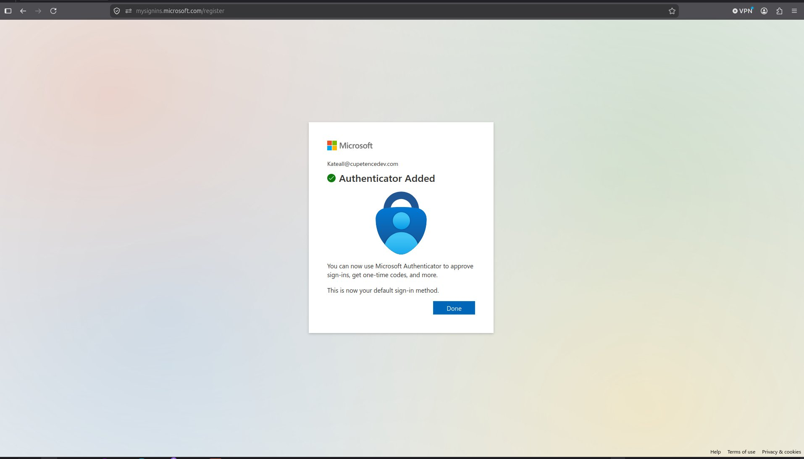

---

### Step 23 — ✅ Authentication Completed — Stay Signed In

After successfully completing MFA registration and authentication, I was presented with the **Stay signed in?** prompt, confirming the full authentication flow — password + MFA push approval — completed successfully for the test user. I selected **Yes**.

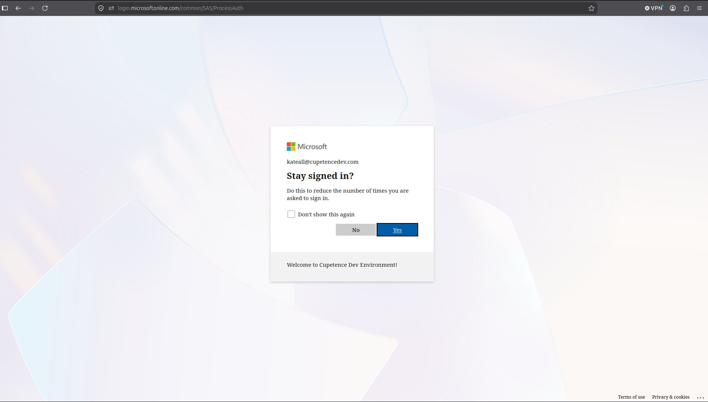

---

## Summary

In this lab, I successfully completed all three phases of Conditional Access MFA enforcement:

| # | Achievement |
|---|---|
| ✅ 1 | Created the Microsoft 365 group **CA-Test-Users** with owner and test member |
| ✅ 2 | Built a new Conditional Access policy targeting **CA-Test-Users** across all cloud apps |
| ✅ 3 | Configured the policy to **Grant Access only when MFA is satisfied** |
| ✅ 4 | Disabled **Security Defaults** to allow the custom Conditional Access policy to take effect |
| ✅ 5 | Deployed the policy with state set to **On** — confirmed active in the Entra dashboard |
| ✅ 6 | Verified the policy end-to-end: signed in as test user, completed MFA registration via Microsoft Authenticator, passed number-match push notification, and successfully authenticated |

> 🔒 The Conditional Access policy is now active and enforcing MFA for all users in the **CA-Test-Users** group across all cloud applications in the @tenantname tenant.

---

## 🛠️ Technologies Used

