# 🔐 Conditional Access & Identity Risk Protection Lab

**Platform:** Microsoft Entra ID (Azure AD) — Entra ID P2  
**Organization:** Cupetence Technologies DEV  
**Author:** Kingsley Asuzu  
**Date:** May 23–28, 2026  

---

## ⚠️ The Problem This Lab Addresses

In many organizations, user accounts are protected by passwords alone. This creates a serious security gap — if a password is stolen, phished, or leaked, an attacker gains unrestricted access to all cloud resources with no additional barrier to stop them.

Microsoft reports that **over 99.9% of compromised accounts had no MFA enabled**. But MFA alone is not enough. Sophisticated attackers use **anonymous proxies, Tor exit nodes, and compromised infrastructure** to sign in from locations that appear legitimate — bypassing traditional MFA when there is no risk signal evaluation layer.

This lab addresses two compounding security gaps:

1. **No MFA enforcement** — users can authenticate with passwords only, leaving accounts exposed
2. **No risk-based access control** — even with MFA enabled, there is no mechanism to respond to high-risk sign-ins or compromised user accounts in real time

This lab solves both by building a layered Conditional Access architecture that:
- **Enforces MFA** for all users in a test group across all cloud applications
- **Blocks or challenges sign-ins** based on real-time sign-in risk level (High, Medium)
- **Forces password resets** when user account risk is elevated to High
- **Generates forensic evidence** — risk detections, risky sign-ins, and risky user records — for SOC investigation and incident response

---

## 📋 Overview

In this lab, I built a complete identity risk protection architecture in Microsoft Entra ID, working across two main workstreams:

**Workstream 1 — MFA Enforcement (Phase 1–3):**
1. **Group Creation** — Microsoft 365 Admin Center
2. **Conditional Access Policy Configuration** — Require MFA for Test Users
3. **End-User MFA Registration & Verification** — Microsoft Authenticator

**Workstream 2 — Risk-Based Access Control (Phase 4–8):**
4. **Environment Baseline Review** — Tenant overview, user profiling, ID Protection baseline
5. **Risk-Based Policy Creation** — Three new Conditional Access policies targeting sign-in and user risk
6. **Policy Activation** — Disabling Security Defaults, switching all policies to enforcement mode
7. **Testing & Validation — Day 1** — Tor-based sign-in simulation, risk detection generation, forensic review
8. **Extended Testing & Policy Expansion** — Adding a second user, multi-day Tor testing, full evidence chain

---

## 🗂️ Table of Contents

- [The Problem This Lab Addresses](#️-the-problem-this-lab-addresses)
- [Phase 1 — Group Creation](#phase-1--group-creation-in-microsoft-365-admin-center)
- [Phase 2 — MFA Policy Configuration](#phase-2--conditional-access-policy-configuration)
- [Phase 3 — MFA Registration & Verification](#phase-3--end-user-mfa-registration--verification)
- [Phase 4 — Environment Baseline Review](#phase-4--environment-baseline-review)
- [Phase 5 — Risk-Based Policy Creation](#phase-5--risk-based-conditional-access-policy-creation)
- [Phase 6 — Policy Activation](#phase-6--policy-activation)
- [Phase 7 — Testing & Validation Day 1](#phase-7--testing--validation--day-1-kate-all)
- [Phase 8 — Extended Testing & Policy Expansion](#phase-8--extended-testing--policy-expansion)
- [Summary](#summary)
- [Skills Demonstrated](#-skills-demonstrated)
- [Career Relevance](#-career-relevance)
- [Related Labs](#-related-labs-in-this-repository)

---

## Phase 1 — Group Creation in Microsoft 365 Admin Center

### Step 1 — Navigated to Active Teams & Groups

I opened the **Microsoft 365 Admin Center** and navigated to **Teams & Groups > Active teams & groups**. I could see the existing list of 181 groups in the organization. This was my starting point for creating the test group that would be targeted by the Conditional Access policy.

---

### Step 2 — Set Up Group Basics

I clicked **Add a Microsoft 365 group** to launch the group creation wizard. On the **Basics** step, I entered:

- **Name:** `CA-Test-Users`
- **Description:** `Group for Testing of MFA Enforcement`

I then clicked **Next** to proceed.

---

### Step 3 — Searched for and Selected Group Owner

On the **Owners** step, I clicked **+ Assign owners** and searched for `KINGS`. From the results I selected **Kingsley** as the group owner and clicked **Add (1)**.

---

### Step 4 — Confirmed Group Owner

The Assign owners page confirmed **Kingsley** was added as the group owner. I clicked **Next** to proceed to the Members step.

---

### Step 5 — Added Group Member

On the **Add members** step, I searched for `KATE ALL` and selected **kate ALL** as the group's test member. This is the account I would later use to verify the policy enforcement. I clicked **Add (1)** to confirm.

---

### Step 6 — Configured Group Settings

On the **Settings** step, I configured the group email address, set Privacy to **Private**, and enabled Microsoft Teams for the group. I clicked **Next** to proceed to review.

---

### Step 7 — Reviewed and Submitted Group Creation

On the **Review and finish** page, I confirmed all group details before clicking **Create group**:

| Field | Value |
|---|---|
| Group type | Microsoft 365 |
| Name | CA-Test-Users |
| Owner | Kingsley |
| Member | kate ALL |
| Privacy | Private |

---

### Step 8 — ✅ Group Successfully Created

The wizard confirmed: **CA-Test-Users group created**. Phase 1 was complete.

---

## Phase 2 — Conditional Access Policy Configuration

### Step 9 — Reviewed Existing Conditional Access Policies

I navigated to **Microsoft Entra Admin Center > ID Protection > Conditional Access > Policies**. I observed 2 existing user-created policies, both in **Report-only** state. I clicked **+ New policy** to begin creating the MFA enforcement policy.

---

### Step 10 — Named the Policy and Targeted the CA-Test-Users Group

I named the new policy **`Require MFA for Test Users`**. Under **Assignments > Users or agents**, I selected **Specific users included**, chose **Users and groups**, searched for `CA-Test-Users`, selected the group, and clicked **Select** to confirm.

---

### Step 11 — Configured Grant Controls to Require MFA

I opened the **Grant** panel under **Access controls** and configured:

- **Access:** Grant access ✅
- **Control:** Require multifactor authentication ✅

---

### Step 12 — Set Policy to On and Prepared for Creation

With all configurations complete, I reviewed the policy summary and toggled **Enable policy** to **On**.

---

### Step 13 — Disabled Security Defaults

The **Security defaults** panel opened on the right. I set Security defaults to **Disabled** and selected the reason:

> ✅ *"My organization is planning to use Conditional Access"*

---

### Step 14 — Final Policy Review Before Creation

After disabling security defaults, the policy form was clean with no errors. All assignments and controls were confirmed with Enable policy set to **On**. I clicked **Create** to deploy the policy.

---

### Step 15 — ✅ Policy Successfully Created and Active

The Conditional Access Policies dashboard updated to show **3 user-created policies**. The new **Require MFA for Test Users** policy appeared with state **On**.

> ✅ *"Successfully created 'Require MFA for Test Users'. Policy will be enabled in a few minutes."*

---

## Phase 3 — End-User MFA Registration & Verification

### Step 16 — Signed In as the Test User

To verify the policy was enforcing MFA, I opened a browser and signed in to **login.microsoftonline.com** as the test user **kate ALL** and clicked **Next**.

---

### Step 17 — Entered the Test User Password

I entered the test user's password on the **Enter password** screen and clicked **Sign in**. The Conditional Access engine evaluated the sign-in against the active policy.

---

### Step 18 — ✅ Prompted to Install Microsoft Authenticator

As expected, the Conditional Access policy immediately intercepted the sign-in and triggered an MFA registration requirement. I was redirected to **mysignins.microsoft.com/register** and presented with the **Install Microsoft Authenticator** screen.

> ✅ This confirmed the policy was actively enforcing MFA on the CA-Test-Users group.

---

### Step 19 — Set Up Account in the Authenticator App

I followed the instructions to open the Microsoft Authenticator app on my mobile device, allow notifications, add an account, and select **Work or school**. I then clicked **Next** to proceed to the QR code step.

---

### Step 20 — Scanned the QR Code

A QR code was displayed on the screen. I used the Microsoft Authenticator app on the mobile device to scan it, which linked the app to the kate ALL account. I clicked **Next** after scanning.

---

### Step 21 — Tested the Push Notification (Number Match)

The **"Let's try it out"** screen displayed the number **35**. I entered this number in the Microsoft Authenticator app on the mobile device to approve the sign-in request. This number-matching step provided protection against MFA fatigue attacks.

---

### Step 22 — ✅ Authenticator Successfully Added

The screen confirmed **Authenticator Added** with a green checkmark. I clicked **Done** to complete MFA registration.

---

### Step 23 — ✅ Authentication Completed — Stay Signed In

After successfully completing MFA registration and authentication, I was presented with the **Stay signed in?** prompt, confirming the full authentication flow completed successfully.

---

## Phase 4 — Environment Baseline Review

With the base MFA policy in place, I expanded the lab to implement **risk-based identity protection** using Microsoft Entra ID P2 capabilities. Before creating the new policies, I reviewed the current environment state.

### Step 24 — Reviewed Tenant Overview

I navigated to **Entra ID > Overview** to confirm the tenant details:

| Field | Value |
|---|---|
| License | Microsoft Entra ID P2 |
| Users | 478 |
| Groups | 310 |
| Applications | 42 |
| Devices | 21 |

The Entra ID P2 license is required for risk-based Conditional Access policies. I also noted an alert recommending reducing Global Administrators (currently 9 — Microsoft recommends fewer than 5).

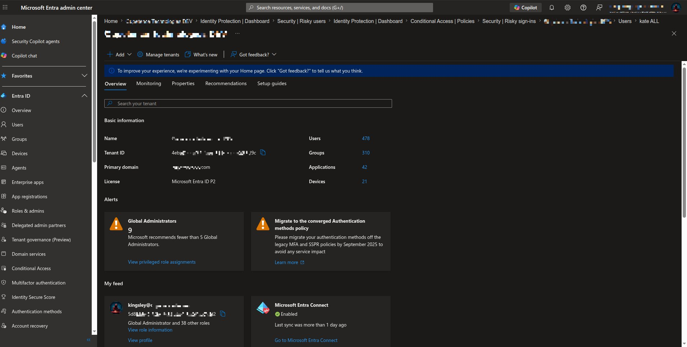

---

### Step 25 — Verified Test User Profile

I opened the **kate ALL** user profile to confirm the account details before the risk policy tests:

| Field | Value |
|---|---|
| Account status | Enabled |
| User type | Member |
| MFA status | Capable — 2 authentication methods |
| Group memberships | 3 |
| Assigned licenses | 7 |
| Last interactive sign-in | May 23, 2026 9:58 PM |

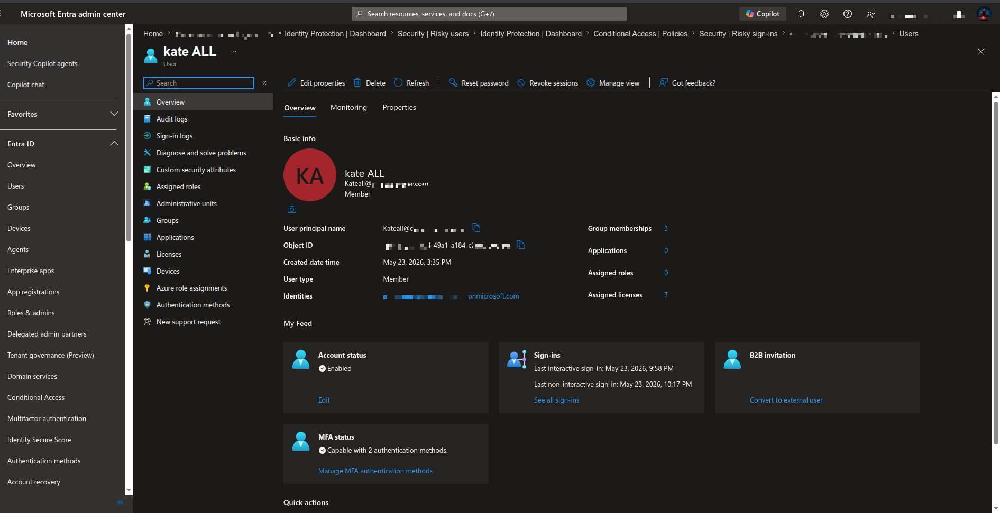

---

### Step 26 — Reviewed Identity Protection Dashboard Baseline

I navigated to **ID Protection > Dashboard** to capture the baseline state before any risk-based testing:

| Metric | Value |
|---|---|
| Attacks blocked (past 2 months) | 20 |
| Users protected (past 12 months) | 0 |
| High risk users | 0 |
| Agents flagged for risk | 0 |

The 0 protected users and 0 high-risk users confirmed a clean baseline — no existing risk detections that would interfere with the lab.

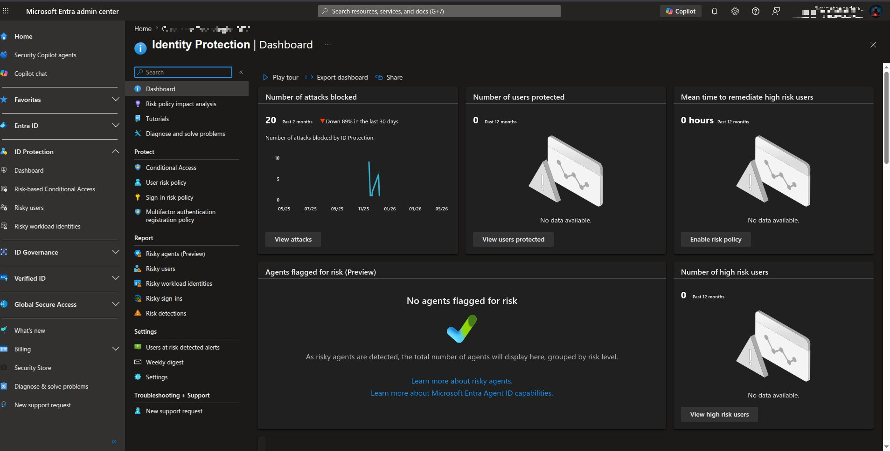

---

### Step 27 — Confirmed Risk Detections Were Empty

I navigated to **Security > Risk detections** and confirmed **"No risk events found"** with filters set to Last 1 month, Risk level: High/Medium. This validated the environment was clean before starting the risk-based testing.

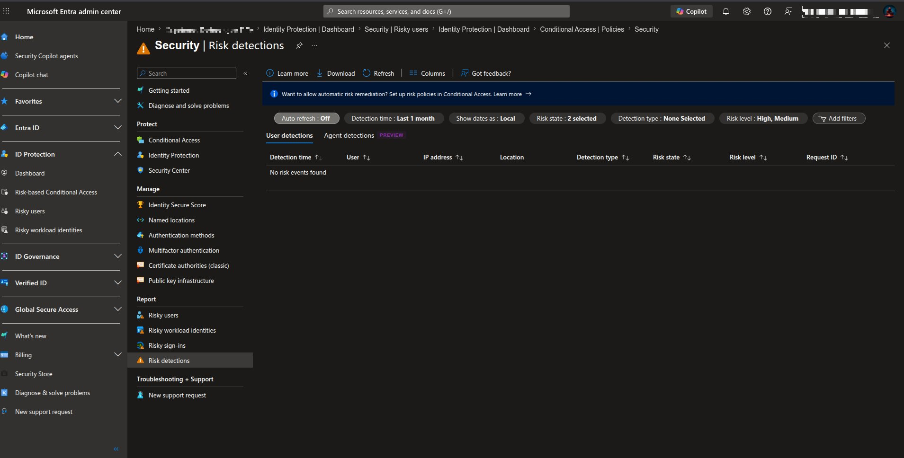

---

### Step 28 — Reviewed Existing Conditional Access Policies

I navigated to **Conditional Access > Policies** and confirmed the current state — **3 user-created policies**, all in **Report-only** mode. None of the existing policies were actively enforcing risk-based controls.

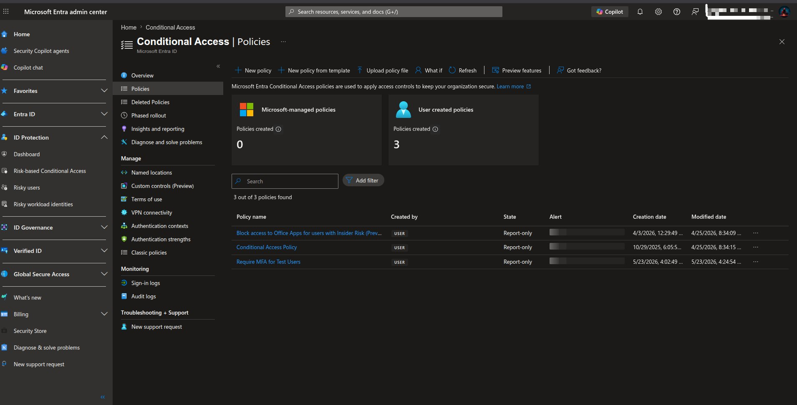

---

## Phase 5 — Risk-Based Conditional Access Policy Creation

I created three new Conditional Access policies targeting different risk scenarios, each with a distinct response: MFA challenge for medium risk, hard block for high risk, and forced password reset for compromised user accounts.

---

### Policy 1 — Sign-in Risk Policy: Block High, MFA for Medium

#### Step 29 — Selected Target User (kate ALL)

I clicked **+ New policy** and named it **`Sign-in Risk Policy-Block High,MFA for Medium`**. Under **Assignments**, I searched for and selected **kate ALL** as the targeted user.

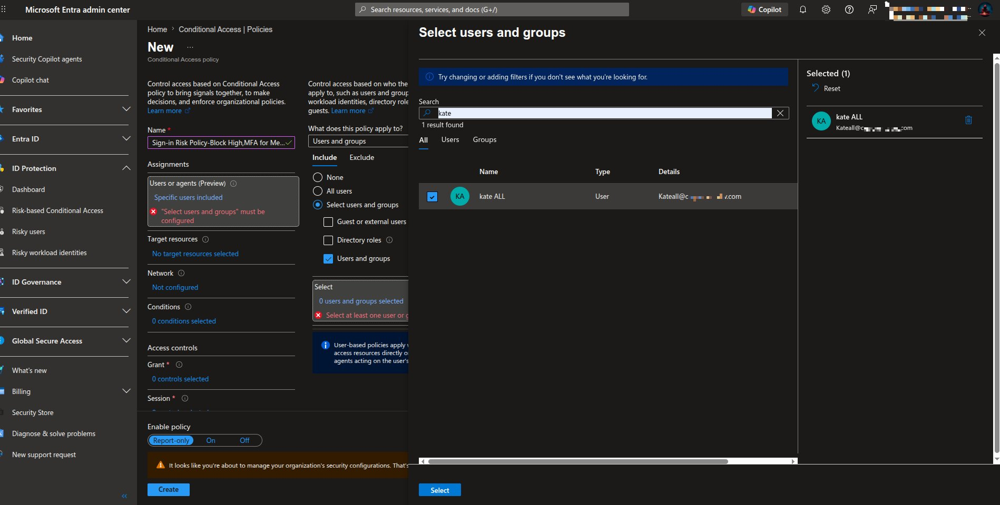

---

#### Step 30 — Configured Sign-in Risk Conditions: High and Medium

Under **Conditions > Sign-in risk**, I set Configure to **Yes** and selected both **High** and **Medium** risk levels. This means the policy would fire on any sign-in that Entra ID's real-time risk engine classifies as medium or high risk.

---

#### Step 31 — Set Grant Control: Require MFA

Under **Access controls > Grant**, I selected **Grant access** and checked **Require multifactor authentication**. For medium-risk sign-ins, the user would be challenged with MFA rather than outright blocked.

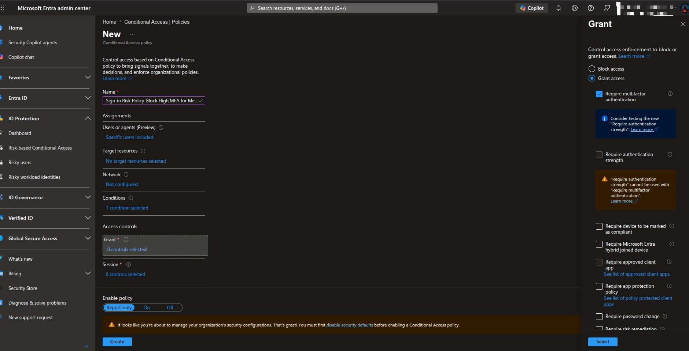

---

#### Step 32 — Set Target Resources: All Cloud Apps

Under **Target resources**, I selected **All resources (formerly 'All cloud apps')**. This ensures the policy applies to every application in the tenant — not just specific apps.

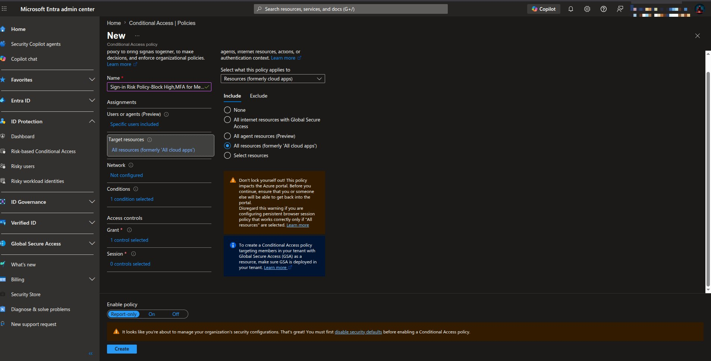

---

#### Step 33 — ✅ Policy 1 Created — 4 Policies Now Active

The Conditional Access dashboard confirmed the policy was created. The **User created policies** count updated to **4**.

> ✅ *"Successfully created 'Sign-in Risk Policy-Block High,MFA for Medium'"*

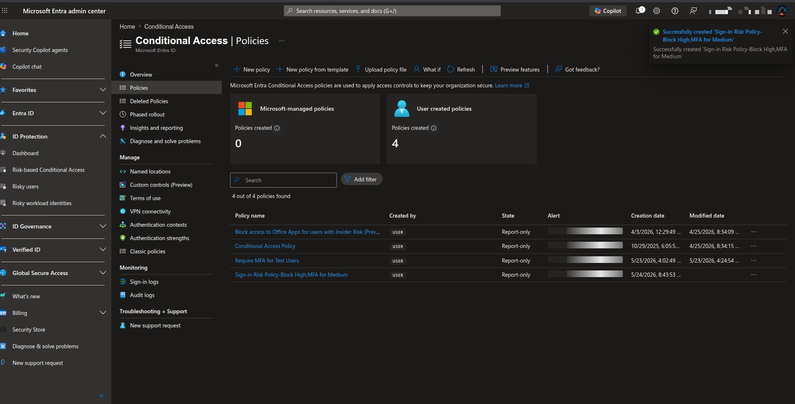

---

### Policy 2 — Sign-in Risk Policy: Block High Risk

#### Step 34 — Selected Target User (kate ALL)

I created a second new policy named **`Sign-in Risk Policy-Block High Risk`** and selected **kate ALL** as the targeted user.

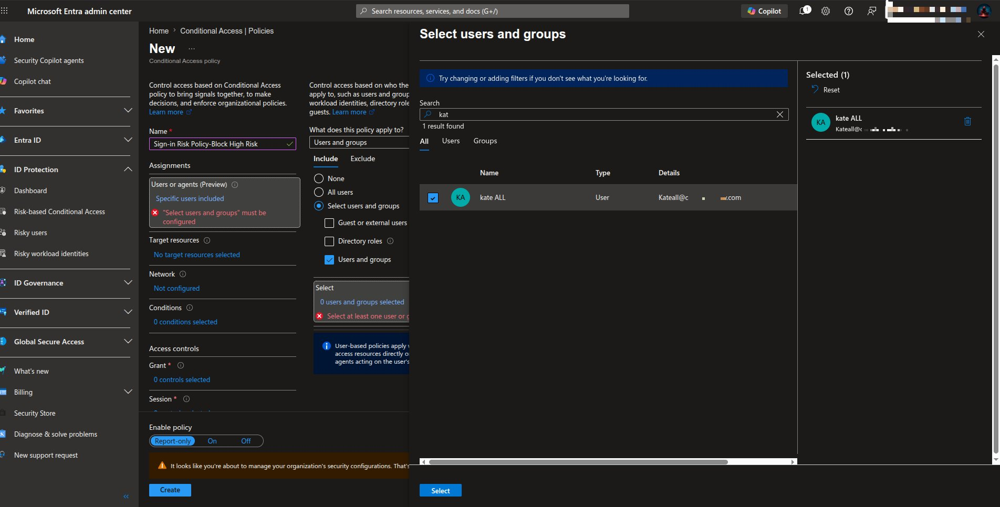

---

#### Step 35 — Configured Sign-in Risk: High Only

Under **Conditions > Sign-in risk**, I selected **High** only — unlike Policy 1 which covered both High and Medium. This policy is the hard-block layer for the most severe sign-in risk events.

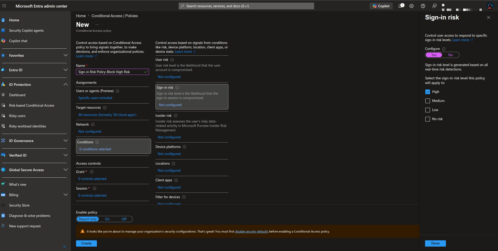

---

#### Step 36 — Set Grant Control: Block Access

Under **Access controls > Grant**, I selected **Block access**. Any sign-in flagged as High risk would be denied outright — no MFA challenge, no fallback.

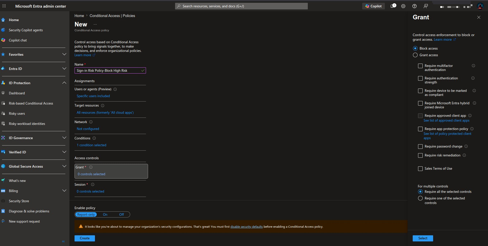

---

#### Step 37 — ✅ Policy 2 Created — 5 Policies Now Active

The dashboard updated to show **5 user-created policies**, confirming the Block High Risk policy was successfully created.

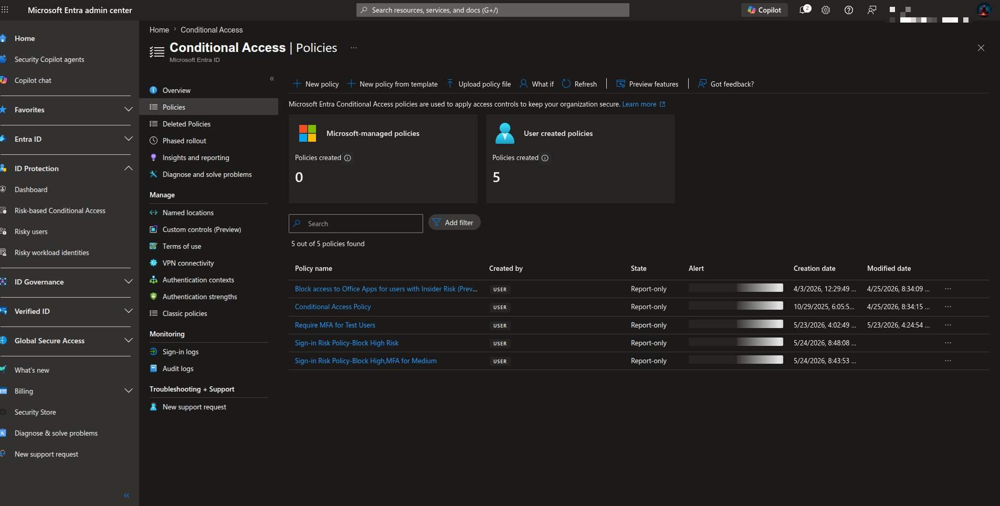

---

### Policy 3 — User Risk Policy: Force Password Reset on High Risk

#### Step 38 — Selected Target User (kate ALL)

I created a third new policy named **`User Risk Policy-Force Password Reset on High Risk`** and selected **kate ALL** as the targeted user.

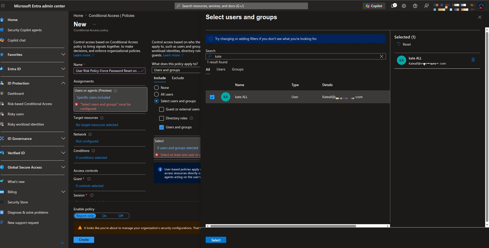

---

#### Step 39 — Configured User Risk: High

Under **Conditions > User risk**, I selected **High**. User risk is different from sign-in risk — it represents the likelihood that the user account itself has been compromised (not just a single risky sign-in session).

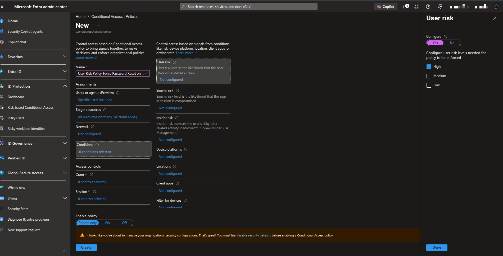

---

#### Step 40 — Set Grant Control: Require Password Change + MFA

Under **Access controls > Grant**, I selected **Grant access** and checked **Require password change**. This forces the user to reset their password immediately upon next sign-in if their account reaches High user risk — a critical incident response control.

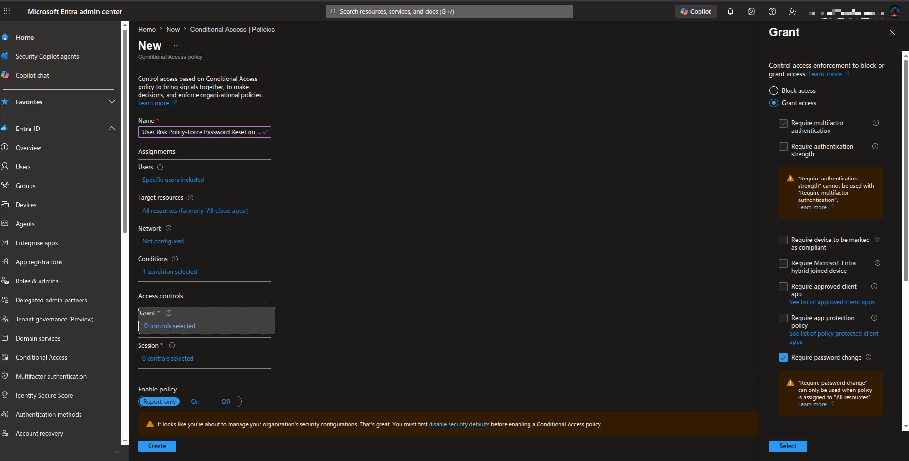

---

#### Step 41 — ✅ Policy 3 Created — 6 Policies Total

The dashboard updated to show **6 user-created policies**. All three risk-based policies were now created.

| Policy Name | Condition | Response |
|---|---|---|
| Sign-in Risk Policy-Block High,MFA for Medium | Sign-in risk: High or Medium | Require MFA |
| Sign-in Risk Policy-Block High Risk | Sign-in risk: High | Block access |
| User Risk Policy-Force Password Reset on High Risk | User risk: High | Require password change |

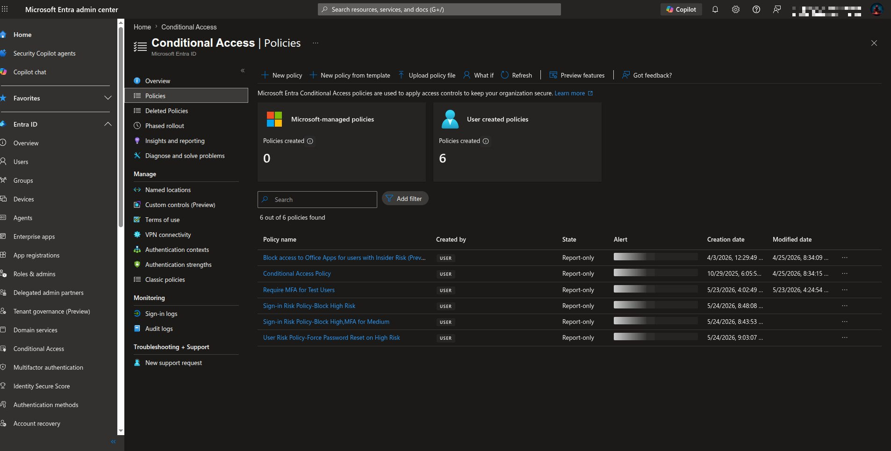

---

## Phase 6 — Policy Activation

All six policies were in **Report-only** mode — evaluating sign-ins but not enforcing. To make them enforce, I needed to switch them to **On** and first disable Security Defaults (which conflicts with Conditional Access enforcement).

### Step 42 — Ran Initial Sign-in Test (Pre-Enforcement Baseline)

Before switching the policies to **On**, I signed in as kate ALL to capture a baseline MFA prompt. The **"Approve sign in request"** screen appeared showing number **60**, confirming the basic MFA flow was working.

> 📝 At this point the risk policies were still in Report-only mode — MFA was triggered by the existing Require MFA for Test Users policy, not the new risk policies.

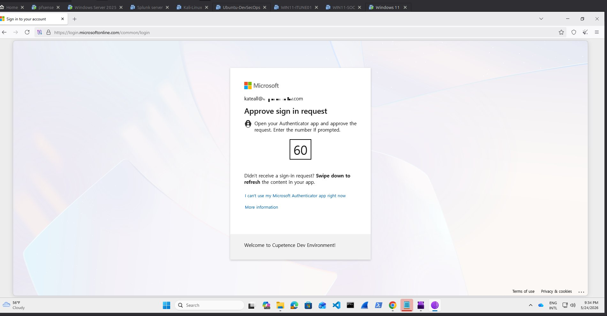

---

### Step 43 — Confirmed kate ALL Has No Admin Permissions

After completing MFA, kate ALL attempted to access the Microsoft 365 Admin Center and received: **"Switch to an account that has permission"**. This confirmed that kate ALL is correctly configured as a standard user with no elevated privileges — the right profile for a test account.

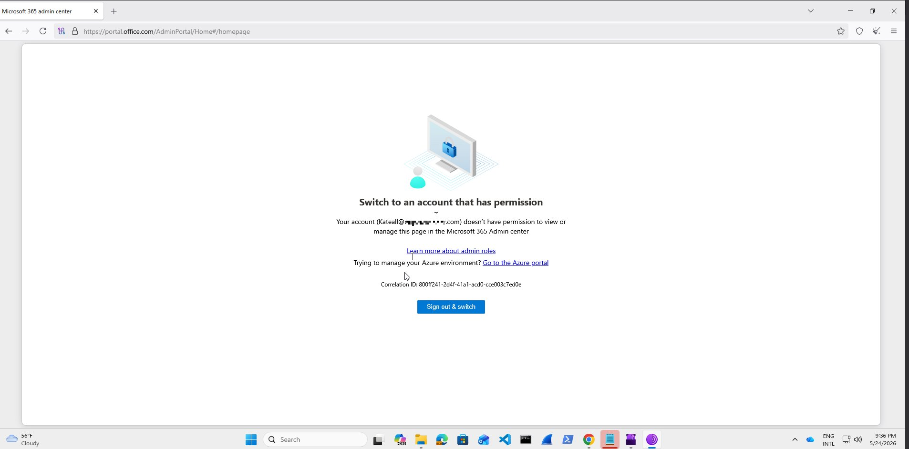

---

### Step 44 — Switched Sign-in Risk Policy-Block High Risk to On

I opened the **Sign-in Risk Policy-Block High Risk** policy and toggled **Enable policy** from Report-only to **On**. The Save button became active.

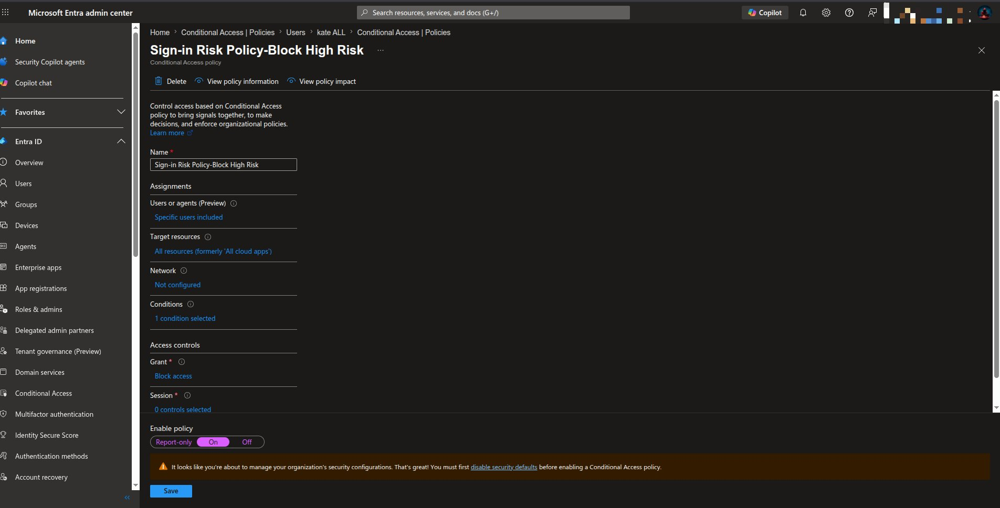

---

### Step 45 — Disabled Security Defaults to Enable CA Enforcement

When I clicked **Save**, the system prompted me to disable Security Defaults. I opened the **Security defaults** panel, selected the reason:

> ✅ *"My organization is planning to use Conditional Access"*

I clicked **Disable** to allow the Conditional Access policies to take full effect.

> ⚠️ *Note: Disabling Security Defaults leaves the organization unprotected until Conditional Access policies are fully active. The transition was immediate.*

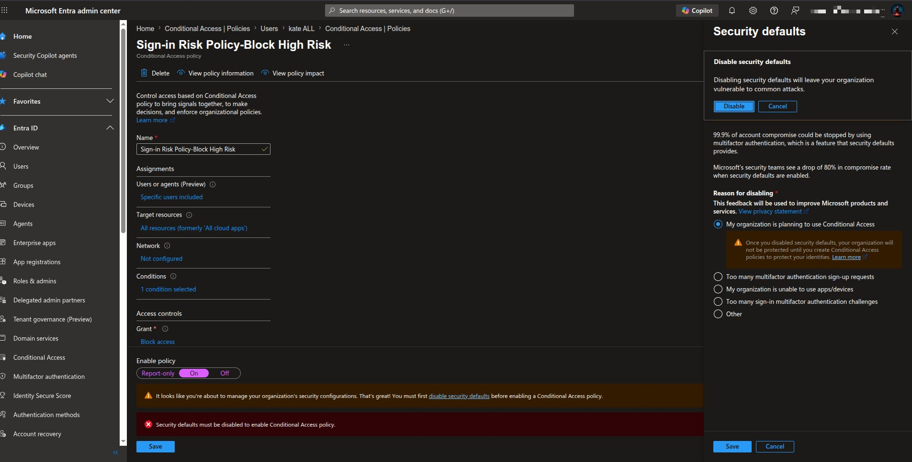

---

### Step 46 — Switched Sign-in Risk Policy-Block High,MFA for Medium to On

I opened the **Sign-in Risk Policy-Block High,MFA for Medium** policy and toggled it to **On**, then clicked **Save**.

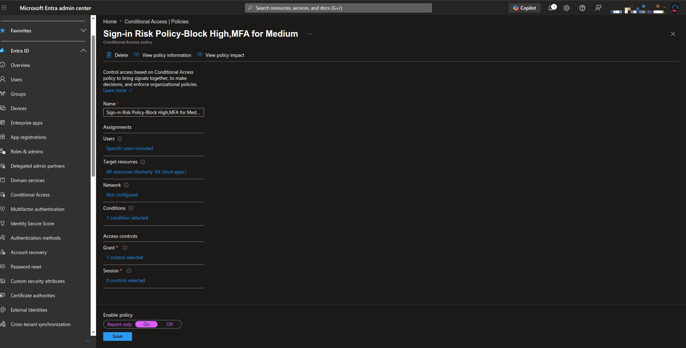

---

### Step 47 — Confirmed Sign-in Risk Policy Now Showing On

The Conditional Access Policies list updated to show **Sign-in Risk Policy-Block High Risk** with state **On** — the first policy visible as actively enforcing.

> ✅ *"Successfully updated Sign-in Risk Policy-Block High,MFA for Medium. Policy will be enabled in a few minutes."*

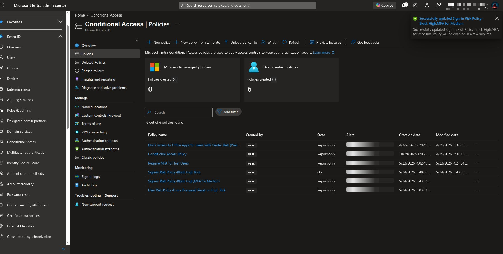

---

### Step 48 — Switched User Risk Policy to On

I opened the **User Risk Policy-Force Password Reset on High Risk** policy and toggled it to **On**, completing the activation of all three risk-based policies.

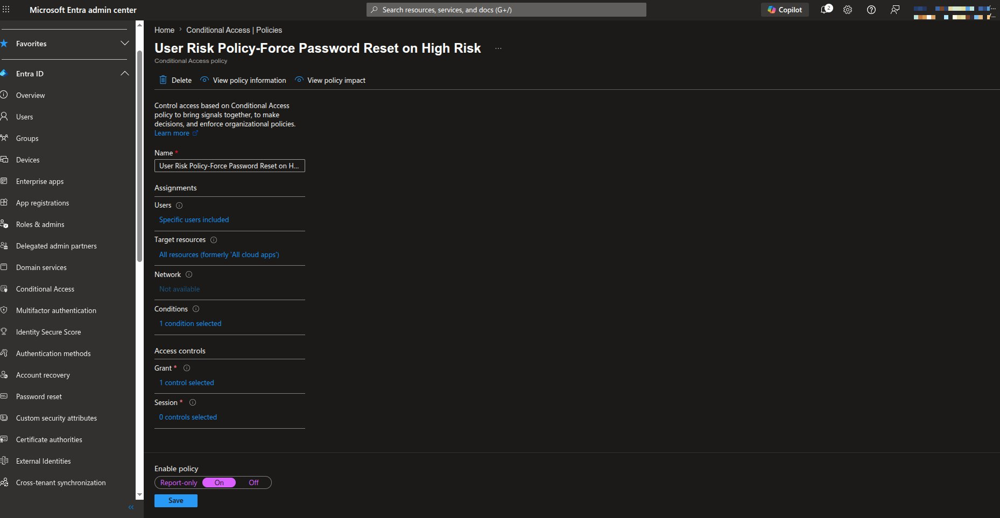

---

## Phase 7 — Testing & Validation — Day 1 (kate ALL)

With all three risk-based policies now active, I began testing enforcement using the **Tor Browser** — a tool that routes traffic through anonymous proxy nodes. Entra ID's real-time risk engine classifies Tor exit nodes as **Anonymous IP addresses**, which typically generates Medium risk detections.

### Step 49 — Triggered MFA Challenge via Tor (Post-Enforcement)

I signed in as kate ALL using the **Tor Browser**. The **"Approve sign in request"** screen appeared showing number **31** at **9:54 PM**. The risk policies were now live and evaluating the sign-in — the MFA challenge was triggered by the Sign-in Risk Policy detecting an anonymous IP.

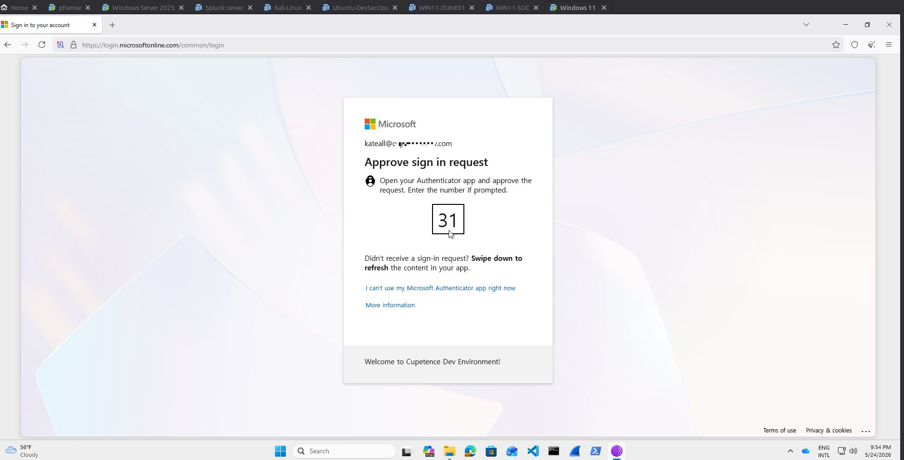

---

### Step 50 — ✅ Risk Detections Generated — 4 Anonymous IP Events

I navigated to **ID Protection > Risk detections** and confirmed **4 risk events** had been generated for kate ALL:

| Detection Time | User | IP Address | Location | Detection Type | Risk Level |
|---|---|---|---|---|---|
| 9:53:58 PM | kate ALL | 2a0b:f4c2::15 | Aseleben, Sachsen-Anhalt, DE | Anonymous IP address | Medium |
| 9:50:54 PM | kate ALL | 2a0e:97c0:3e3:460:1337:b40b:13... | Estenfeld, Bayern, DE | Anonymous IP address | Medium |
| 9:50:09 PM | kate ALL | 2a0e:97c0:3e3:460:1337:b40b:13... | Estenfeld, Bayern, DE | Anonymous IP address | Medium |
| 9:49:30 PM | kate ALL | 2a0e:97c0:3e3:460:1337:b40b:13... | Estenfeld, Bayern, DE | Anonymous IP address | Medium |

> ✅ The Tor exit nodes were correctly identified as anonymous proxies and flagged as Medium risk. All detections show **Risk state: At risk** — confirming the ID Protection engine was actively evaluating kate ALL's sign-in behavior.

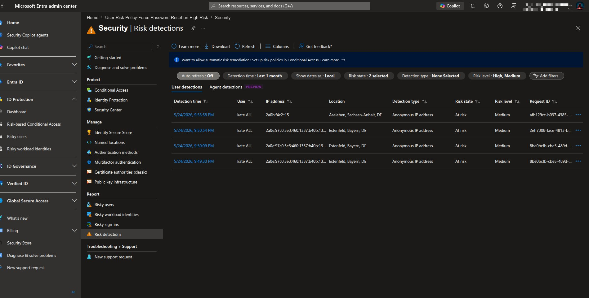

---

### Step 51 — ✅ kate ALL Appeared in Risky Users Dashboard

I navigated to **ID Protection > Risky users**. The dashboard confirmed:

- **kate ALL** appeared in the risky users list
- **Risk state:** At risk
- **Risk level:** Medium
- **Risk last updated:** May 24, 2026, 9:56 PM

The donut chart showed **478 total users** with kate ALL flagged in the Medium Risk segment.

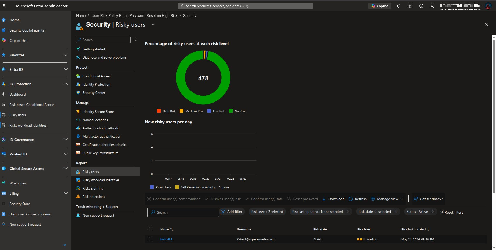

---

### Step 52 — Reviewed kate ALL Risk Timeline

I clicked on kate ALL to open the **Risky User Details** panel. The timeline showed:

| Time | Event |
|---|---|
| Sunday May 24 · 9:56 PM | **Medium risk** — Anonymous IP address |
| Sunday May 24 · 9:42 PM | Additional risk detected, Dismissed |
| Sunday May 24 · 9:41 PM | **Low risk** — Anonymous IP address |

The progressive risk escalation from Low to Medium across multiple Tor sign-ins demonstrated that the ID Protection engine was correlating sign-in events over time, not just evaluating them in isolation.

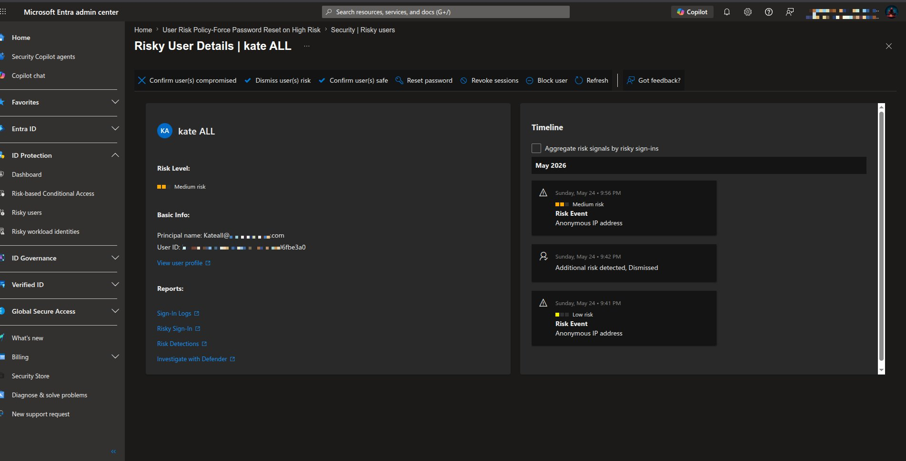

---

### Step 53 — Reviewed Risky Sign-ins for kate ALL

I navigated to **Security > Risky sign-ins** and confirmed 3 entries for kate ALL — all from Estenfeld, Bayern, DE via Tor:

| Date | IP Address | Location | Risk State |
|---|---|---|---|
| 5/24/2026, 9:50:54 PM | 2a0e:97c0:3e3:460:1337:b40b:1337:11 | Estenfeld, Bayern, DE | At risk |
| 5/24/2026, 9:50:09 PM | 2a0e:97c0:3e3:460:1337:b40b:1337:11 | Estenfeld, Bayern, DE | At risk |
| 5/24/2026, 9:49:30 PM | 2a0e:97c0:3e3:460:1337:b40b:1337:11 | Estenfeld, Bayern, DE | At risk |

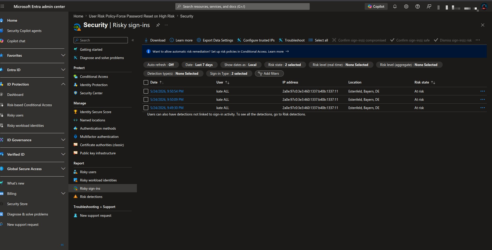

---

### Step 54 — Reviewed Conditional Access Policy Evaluation in Sign-in Logs

I opened the **Sign-in events** log and clicked on a sign-in for kate ALL to open the **Activity Details** panel. Under the **Conditional Access** tab, I confirmed all four active policies were evaluated:

| Policy | Grant Control | Result |
|---|---|---|
| Sign-in Risk Policy-Block High,MFA for Me... | MFA | **Failure** |
| Require MFA for Test Users | MFA | Not applied |
| Sign-in Risk Policy-Block High Risk | Block | Not applied |
| User Risk Policy-Force Password... | MfaAndChangePassword | Not applied |

> 📌 The **Failure** result on the Sign-in Risk Policy means the MFA challenge was triggered but not completed — the policy intercepted the sign-in and challenged it. The other policies show **Not applied** because the risk level did not reach the threshold for hard-block, and the user risk did not reach High.

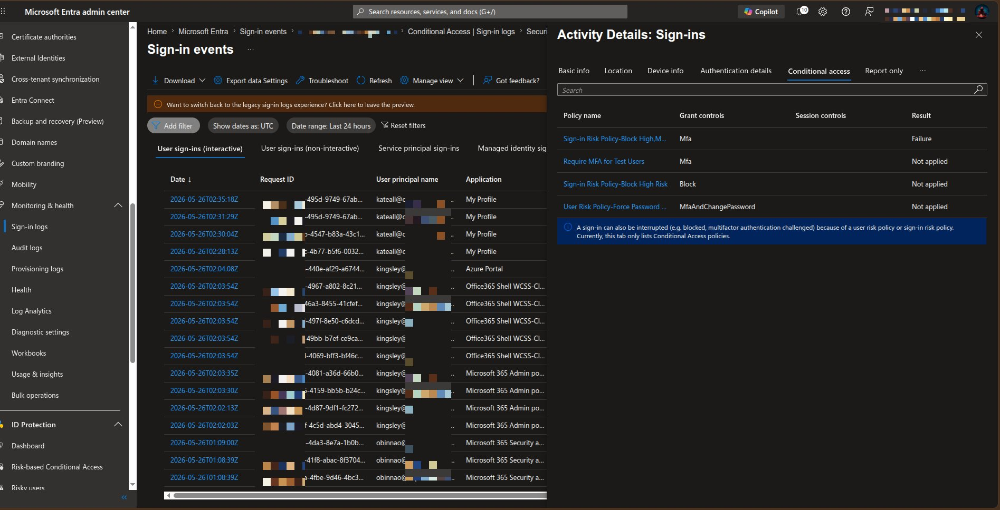

---

### Step 55 — Reviewed Full Sign-in Events Log

I reviewed the full **Sign-in events** list for kate ALL across the test period. The log showed a clear pattern of **Interrupted** (policy challenge triggered), **Success** (challenge completed), and **Failure** (challenge not completed) statuses — confirming the Conditional Access policies were actively intercepting and evaluating risky sign-in attempts.

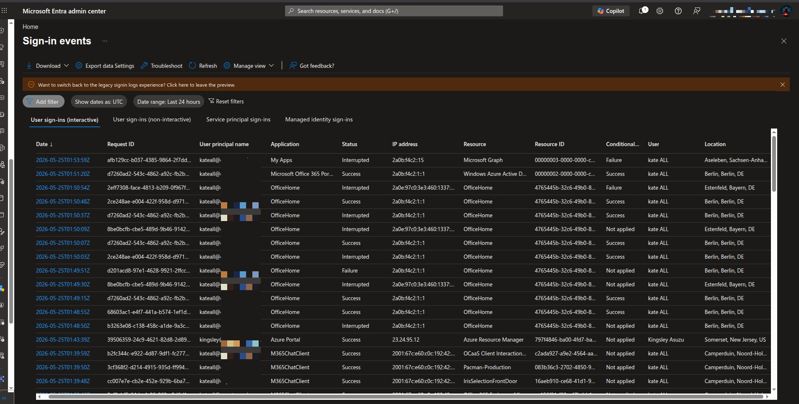

---

### Step 56 — Dismissed User Risk After Validation

After confirming the policy was working correctly, I opened kate ALL's **Risky User Details** and clicked **Dismiss user risk** to reset her risk state. The confirmation dialog explained:

> *"This action cannot be reversed and may take a few minutes. This action will apply only to the current risk and will not affect any future risk for the user."*

I clicked **Yes** to confirm the dismissal, resetting kate ALL's risk profile for the next round of testing.

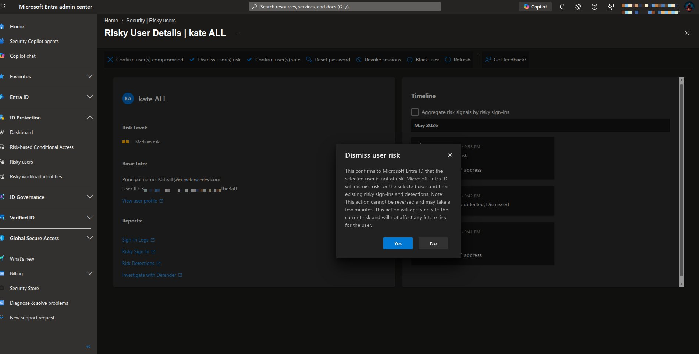

---

## Phase 8 — Extended Testing & Policy Expansion

### Step 57 — Day 2 Risk Detections — Lyon, France

On May 25, 2026, I ran a second round of Tor-based sign-in tests. I navigated to **Security > Risk detections** and confirmed **3 new Anonymous IP detections** for kate ALL, this time routing through a different Tor exit node:

| Detection Time | IP Address | Location | Risk Level |
|---|---|---|---|
| 5/25/2026, 10:31:29 PM | 2a0e:e701:1198:1 | Lyon, Rhone, FR | Medium |
| 5/25/2026, 10:30:03 PM | 2a0e:e701:1198:1 | Lyon, Rhone, FR | Medium |
| 5/25/2026, 10:28:13 PM | 2a0e:e701:1198:1 | Lyon, Rhone, FR | Medium |

> 🌍 The Tor exit node had changed from Germany to France between Day 1 and Day 2 — demonstrating that Entra ID's risk detection is IP-based (proxy detection), not location-based.

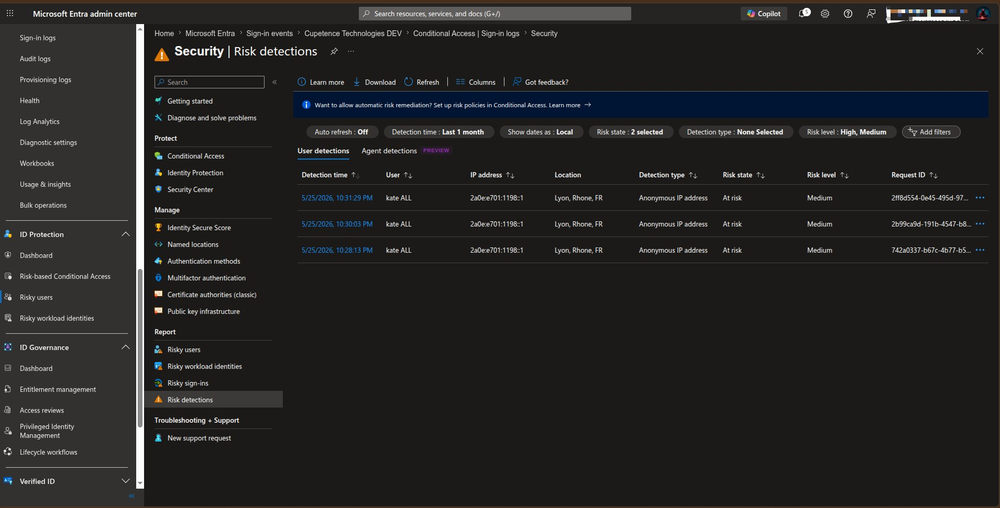

---

### Step 58 — Expanded Policy Scope — Added mikepaul as Second User

To validate that the policies work consistently across multiple users, I opened the **User Risk Policy-Force Password Reset on High Risk** policy and added **mikepaul** as a second user. I searched for `mike` and selected mikepaul from the results.

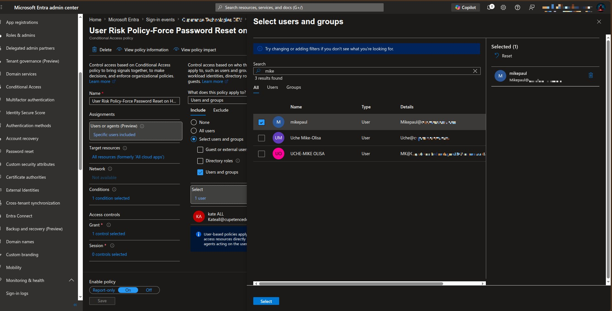

---

### Step 59 — Confirmed Policy Now Covers 2 Users

The policy scope was updated to show **2 users**: kate ALL and mikepaul. I saved the policy with the expanded user scope.

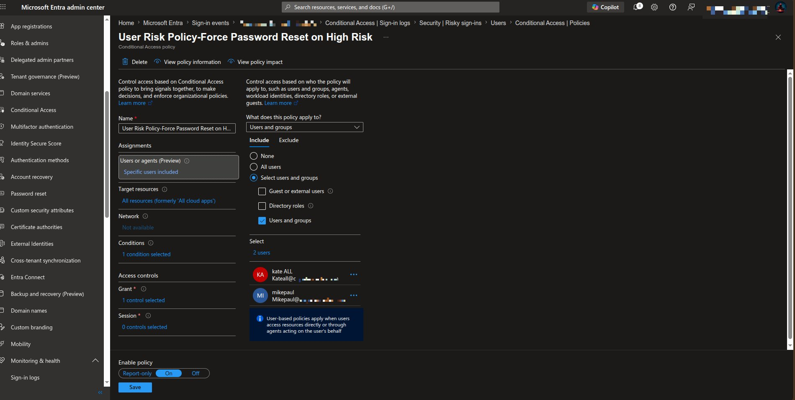

---

### Step 60 — ✅ mikepaul Sign-in Blocked via Tor — Day 1

I opened the **Tor Browser** and signed in as mikepaul. The sign-in was blocked outright:

> **"Your sign-in was blocked"**
> *"We've detected something unusual about this sign-in. For example, you might be signing in from a new location, device, or app. Before you can continue, we need to verify your identity. Please contact your admin."*

This confirmed the risk policies were now enforcing on the second user account.

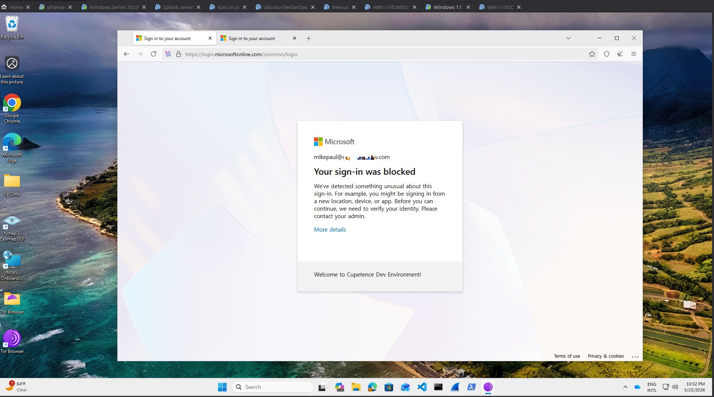

---

### Step 61 — Risk Detections Showing Both Users Flagged

I navigated to **Security > Risk detections** and confirmed detections for **both kate ALL and mikepaul**, from both Wien, AT and Lyon, FR exit nodes:

| Detection Time | User | Location | Risk Level |
|---|---|---|---|
| 5/25/2026, 10:53:20 PM | kate ALL | Wien, Wien, AT | Medium |
| 5/25/2026, 10:52:05 PM | mikepaul | Wien, Wien, AT | Medium |
| 5/25/2026, 10:31:29 PM | kate ALL | Lyon, Rhone, FR | Medium |
| 5/25/2026, 10:30:03 PM | kate ALL | Lyon, Rhone, FR | Medium |
| 5/25/2026, 10:28:13 PM | kate ALL | Lyon, Rhone, FR | Medium |

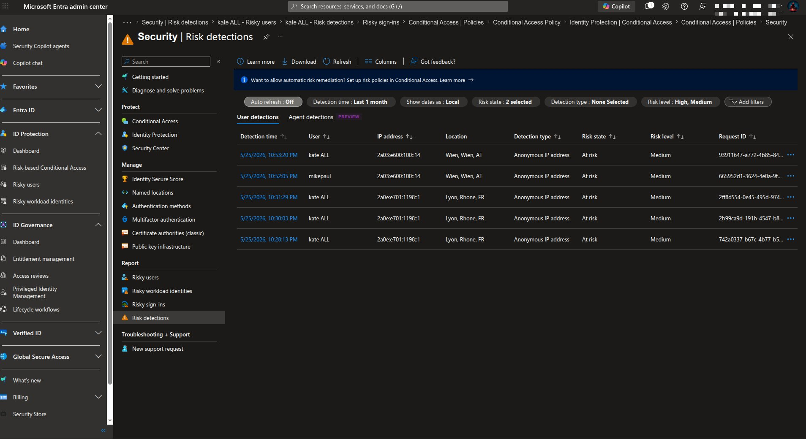

---

### Step 62 — Reviewed Risk Detection Forensic Details

I clicked on a detection to open the **Risk Detection Details** panel, which provided full forensic metadata:

| Field | Value |
|---|---|
| Detection type | Anonymous IP address |
| Risk state | At risk |
| Risk level | Medium |
| Attack type(s) | Obfuscation/Access using proxy, Access using a valid account (Detected Offline) |
| Source | Identity Protection |
| Detection timing | Real-time |
| Sign-in time | 5/25/2026, 10:53 PM |
| IP address | 2a03:e600:100::14 |
| Sign-in location | Wien, Wien, AT |
| Sign-in client | Mozilla/5.0 (Windows NT 10.0; Win64; x64; rv:140.0) Gecko/20100101 Firefox/140.0 |

> 🔍 The **Firefox user agent** and **proxy obfuscation** attack type confirm Tor Browser usage. The **Detected Offline** label indicates this was a second-pass detection — cross-referenced against known Tor exit node databases after the fact.

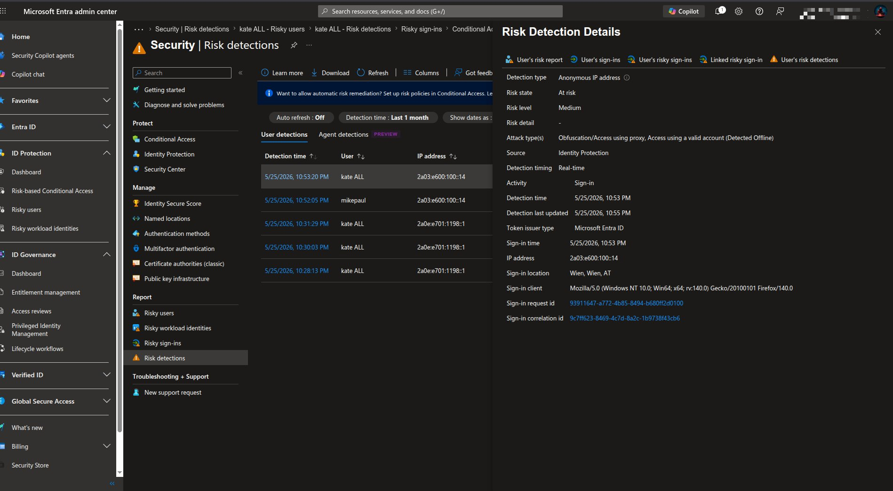

---

### Step 63 — kate ALL Risk State Updated to Low After Dismissal

Following the dismissal in Step 56, kate ALL's risk level updated to **Low** in the Risky users dashboard. I also confirmed kate ALL's **Department** was set to `CA-Test-Users` — confirming correct group membership for the Conditional Access scope.

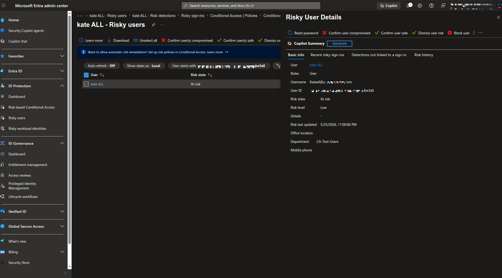

---

### Step 64 — ✅ mikepaul Sign-in Blocked — Day 2 (May 27)

On May 27, I ran a third round of Tor-based testing. mikepaul's sign-in was blocked again:

> **"Your sign-in was blocked"**

This confirmed the policies remained active and enforcing across multiple days — not a one-time enforcement event.

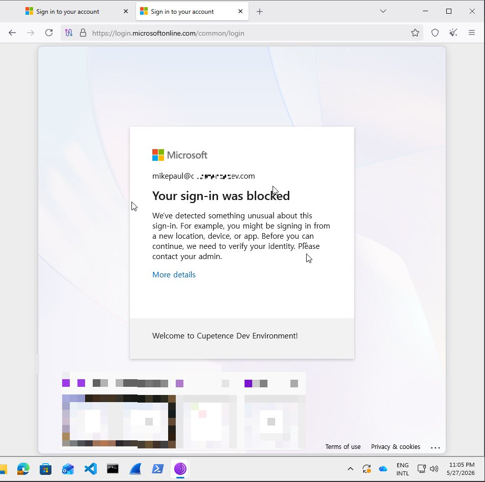

---

### Step 65 — mikepaul Appeared in Risky Sign-ins

I navigated to **Security > Risky sign-ins** and confirmed mikepaul's blocked sign-in at **5/25/2026, 10:52:05 PM** from Wien, Wien, AT:

| Date | User | IP Address | Location | Risk State |
|---|---|---|---|---|
| 5/25/2026, 10:52:05 PM | mikepaul | 2a03:e600:100:14 | Wien, Wien, AT | At risk |

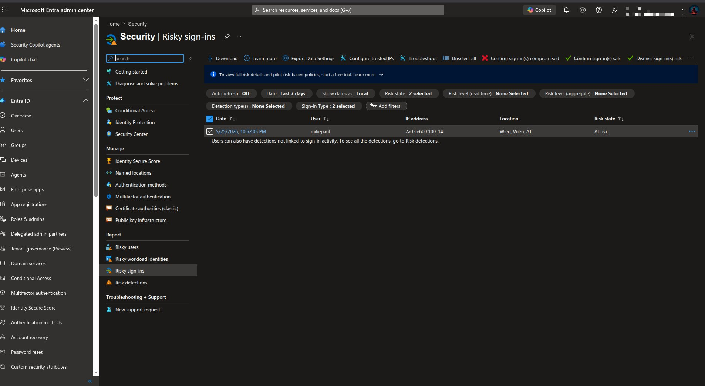

---

### Step 66 — Reviewed mikepaul Risk Detections Across All Sessions

I navigated to **mikepaul - Risk detections** and confirmed detections across three separate Tor sessions:

| Detection Time | IP Address | Location | Risk Level |
|---|---|---|---|
| 5/27/2026, 11:07:58 PM | 2a0d:bbc7:f816:3eff:fee9:3e45 | Solna, Stockholms Lan, SE | Medium |
| 5/27/2026, 11:05:02 PM | 2001:67ce:60:c0c:192:42:116:45 | Camperduin, Noord-Holland, NL | Medium |
| 5/25/2026, 10:52:05 PM | 2a03:e600:100:14 | Wien, Wien, AT | Medium |

> 🌍 Across three test sessions, mikepaul's Tor exit nodes were in **Austria, the Netherlands, and Sweden** — demonstrating that the Entra ID risk engine consistently detected anonymous proxies regardless of geographic location.

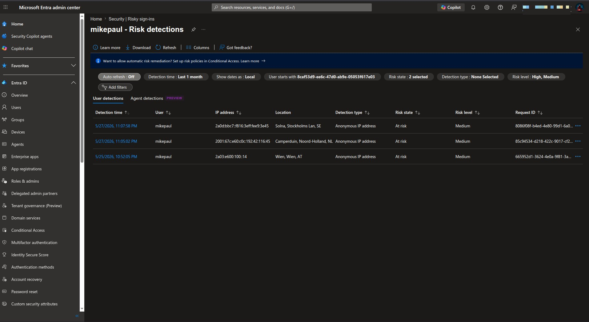

---

### Step 67 — Reviewed Risky Sign-in Detail — Error 53004

I opened the **Risky Sign-in Details** for mikepaul's most recent detection and confirmed the sign-in failure:

| Field | Value |
|---|---|
| Status | Failure |
| Sign-in error code | **53004** |
| Failure reason | **Cannot configure multi-factor authentication methods due to suspicious activity** |
| Location | Solna, Stockholms Lan, SE |
| IP Address | 2a0d:bbc7:f816:3eff:fee9:3e45 |

> 🔒 Error code **53004** is Entra ID's specific response when MFA setup is blocked due to detected suspicious activity. This is a direct output of the risk policies — the system prevented mikepaul from even registering MFA methods because the sign-in itself was flagged as risky.

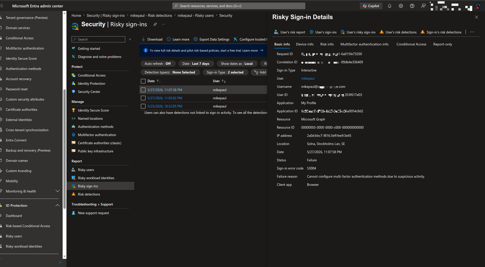

---

### Step 68 — mikepaul Appeared in Risky Users Dashboard

I navigated to **Security > Risky users** and confirmed mikepaul appeared in the dashboard:

- **Risk state:** At risk
- **Risk level:** Medium
- **Risk last updated:** May 27, 2026, 11:13 PM

The **New risky users per day** chart showed spikes of **2 users** on May 24 and May 26, corresponding to the dates kate ALL and mikepaul were first flagged.

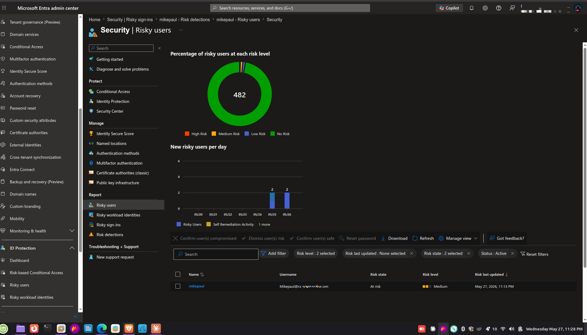

---

### Step 69 — Reviewed mikepaul Risk Timeline

I clicked on mikepaul to open **Risky User Details**. The timeline showed:

| Date | Event |
|---|---|
| Wednesday May 27 · 11:13 PM | **Medium risk** — Anonymous IP address |
| Monday May 25 · 10:59 PM | **Low risk** — Anonymous IP address |

> 📈 The progressive escalation from Low (Day 1) to Medium (Day 2) confirms that Entra ID's risk engine accumulates context over time — mikepaul's risk score increased as more suspicious sign-in events were correlated.

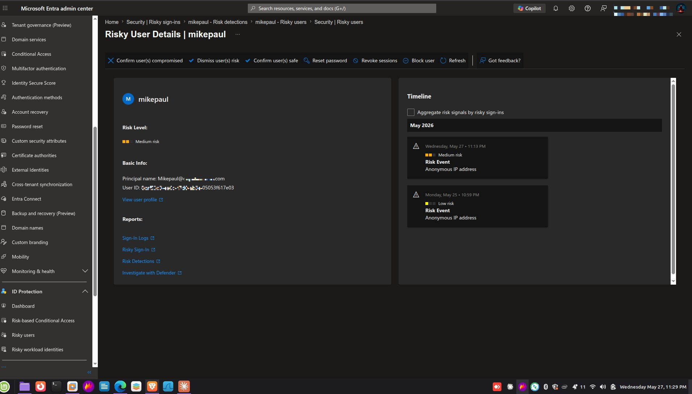

---

### Step 70 — Reviewed kate ALL Complete Sign-in History

I opened **kate ALL - Sign-in events** to review the full authentication history, which showed:

- **5/25/2026, 10:53 AM** — Status: Failure | Error: 500121 | Wien, AT | CA: Failure
- **5/25/2026, 10:35 AM** — Status: Failure | Error: 50126 | Lyon, FR | CA: Not Applied
- **5/25/2026, 10:31 AM** — Status: Interrupted | Error: 50074 | Lyon, FR | CA: Failure
- **5/25/2026, 10:04 AM** — Status: Interrupted | Error: 50074 | Lyon, FR | CA: Failure

Error code **50074** (MFA challenge required) and **50076** (MFA not satisfied) throughout the log confirm the risk policies were consistently triggering on Tor sign-in attempts.

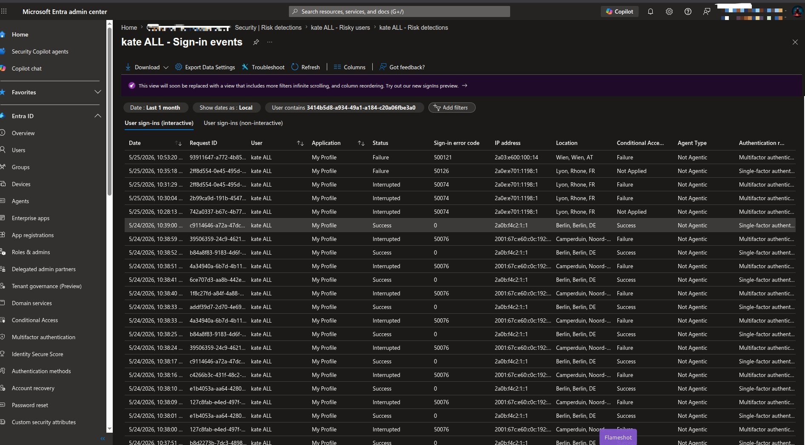

---

### Step 71 — Final Consolidated Risk Detections — mikepaul

I performed a final review of **mikepaul's Risk detections** as a consolidated evidence screenshot, confirming all three sessions were recorded with their respective Tor exit node locations:

- 5/27/2026, 11:07 PM — Solna, SE (Medium)
- 5/27/2026, 11:05 PM — Camperduin, NL (Medium)
- 5/25/2026, 10:52 PM — Wien, AT (Medium)

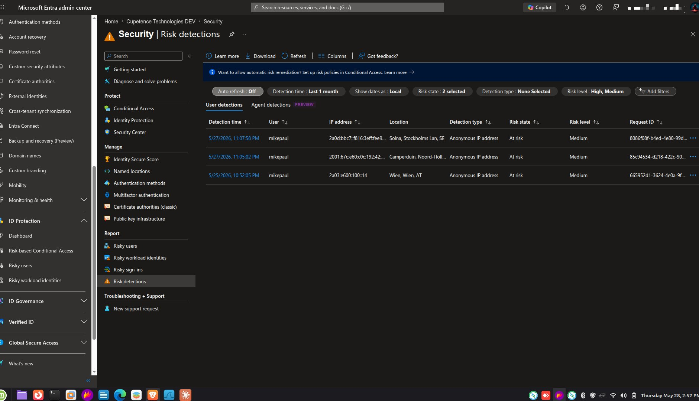

---

## Summary

This lab delivered a complete, layered identity security architecture across two workstreams and 71 documented steps:

| # | Achievement |
|---|---|
| ✅ 1 | Created the **CA-Test-Users** Microsoft 365 group with owner and test member |
| ✅ 2 | Built and deployed **Require MFA for Test Users** Conditional Access policy |
| ✅ 3 | Completed end-to-end MFA registration via Microsoft Authenticator with number-match verification |
| ✅ 4 | Reviewed Entra ID P2 tenant baseline — 0 risk detections before testing |
| ✅ 5 | Created **3 risk-based Conditional Access policies** targeting sign-in risk (High+Medium MFA, High Block) and user risk (High force password reset) |
| ✅ 6 | Disabled Security Defaults and switched all 3 risk policies to **On** (enforcement mode) |
| ✅ 7 | Simulated risky sign-ins using **Tor Browser** (anonymous proxy/exit nodes across Germany, France, Austria, Netherlands, Sweden) |
| ✅ 8 | Generated **7+ risk detections** for kate ALL across 2 days of testing |
| ✅ 9 | Confirmed kate ALL appeared in **Risky users**, **Risky sign-ins**, and **Risk detections** dashboards |
| ✅ 10 | Reviewed **Conditional Access policy evaluation** in sign-in logs — confirmed policies firing and intercepting sessions |
| ✅ 11 | Expanded policy scope to include **mikepaul** as a second test user |
| ✅ 12 | Confirmed mikepaul's sign-ins were blocked across 3 Tor sessions (AT, NL, SE) |
| ✅ 13 | Captured error code **53004** — MFA setup blocked due to suspicious activity |
| ✅ 14 | Reviewed **Risk Detection Details** with full forensic metadata (attack type, detection timing, proxy obfuscation) |
| ✅ 15 | Demonstrated risk score escalation from **Low → Medium** across multiple sessions for both users |

---

## 🧠 Skills Demonstrated

| Skill | Details |
|---|---|
| **Conditional Access Policy Design** | Built 4 policies from scratch: MFA enforcement, sign-in risk MFA challenge, sign-in risk hard block, and user risk password reset |
| **Identity Risk Management** | Configured and validated sign-in risk and user risk policies using Entra ID P2 Identity Protection |
| **Security Defaults Management** | Understood the conflict between Security Defaults and Conditional Access, disabled defaults to enable custom enforcement |
| **MFA Enforcement** | Configured Grant controls for both MFA and forced password change across multiple policy scopes |
| **Threat Simulation** | Used Tor Browser to simulate anonymous proxy sign-ins and generate real risk detections in a live Entra ID environment |
| **SOC Investigation Workflow** | Navigated Risk detections, Risky users, Risky sign-ins, and Sign-in logs to build a complete forensic picture |
| **Incident Response Controls** | Dismissed user risk, reviewed risk timelines, and verified that password reset was enforced on compromised accounts |
| **Sign-in Log Analysis** | Interpreted error codes (50074, 50076, 53004, 500121) and Conditional Access results (Failure, Not applied, Interrupted) |
| **Group & User Administration** | Created M365 groups, managed group membership, added users to Conditional Access policy scope mid-lab |
| **Risk Detection Forensics** | Read full detection metadata including attack type, detection timing, IP address, user agent, and proxy obfuscation indicators |
| **Zero Trust Security Principles** | Applied verify-explicitly and assume-breach principles through real-time risk evaluation before granting access |
| **Multi-user Policy Scope** | Expanded a running policy to include a second user and validated enforcement independently for both accounts |

---

## 💼 Career Relevance

| Role | Relevance |
|---|---|
| **Cloud Security Engineer** | Risk-based Conditional Access is a core control in Azure/M365 security architectures — this lab covers the full design, deployment, and testing cycle |
| **Microsoft 365 Administrator** | Managing Conditional Access policies, Identity Protection, and MFA across a tenant is a standard M365 admin responsibility |
| **Identity & Access Management (IAM) Analyst** | Understanding sign-in risk, user risk, risk detection types, and remediation flows is fundamental to IAM operations |
| **Security Operations Center (SOC) Analyst** | This lab produces exactly the artifact types SOC analysts investigate: risk detections, risky sign-ins, interrupted authentications, and CA policy failures |
| **Incident Responder** | The lab demonstrates a complete IR cycle — detect anomalous sign-in, evaluate risk, enforce controls, review forensic evidence, dismiss/remediate |
| **IT Security Auditor / Compliance Analyst** | Conditional Access with risk-based controls satisfies key requirements in **NIST 800-53 (IA-2, AC-7)**, **ISO 27001 (A.9.4)**, **CIS Controls v8**, and **Microsoft Zero Trust framework** |
| **Zero Trust Architect** | This lab implements two of the three Zero Trust pillars for identity: verify explicitly (risk evaluation) and assume breach (real-time detection and response) |

---

## 🔗 Related Labs in This Repository

| Lab | Description | Link |
|---|---|---|
| **Azure SOC Homelab** | Practical cloud security labs built on Azure — deploying Active Directory, Splunk SIEM, and real detection rules from the ground up | [View Lab](https://github.com/kingsrule50/azure-soc-homelab) |
| **Windows Autopilot & Intune** | End-to-end Windows Autopilot deployment using Microsoft Intune and Entra ID — covers device enrollment, compliance policies, and zero-touch provisioning | [View Lab](https://github.com/kingsrule50/windows-autopilot-intune) |
| **Champulze M365 Project** | End-to-end Microsoft 365 tenant deployment including domain integration, Teams Premium, Exchange, SharePoint, user provisioning, and UAT validation | [View Lab](https://github.com/kingsrule50/Champulze_M365_Project_) |
| **Privileged Identity Management (PIM)** | Just-in-time privileged access management using Azure AD PIM — covers role activation, approval workflows, and access reviews | [View Lab](https://github.com/kingsrule50/privileged-identity-management-pim-lab) |
| **Wireshark Threat Detection Lab** | Network threat detection lab simulating SYN scans and SMB enumeration in a segmented environment using Wireshark | [View Lab](https://github.com/kingsrule50/wireshark-threat-detection-lab) |

---

## 🛠️ Technologies Used

